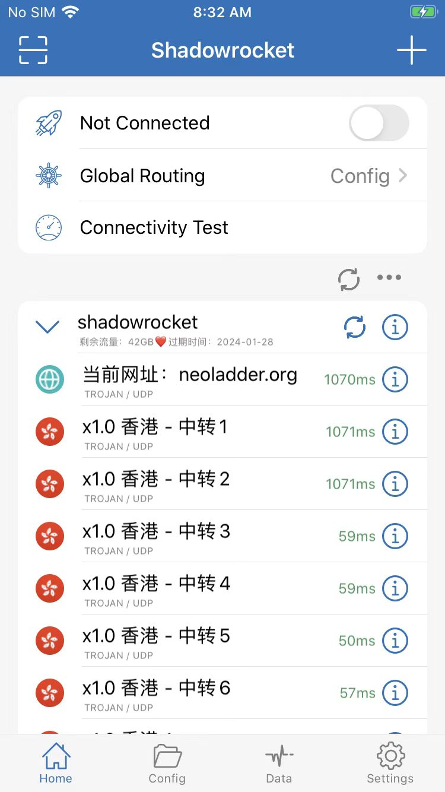
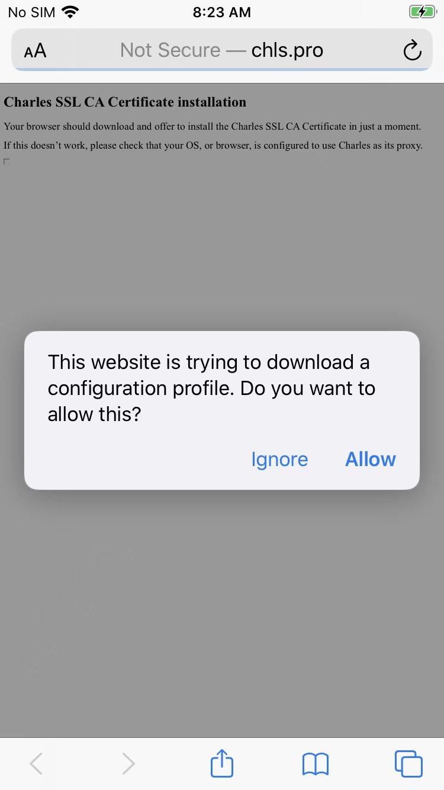

# 安装SSL证书心得：iOS端

## 无法弹框下载SSL证书

* 问题

iPhone中浏览器输入了：

http://chls.pro/ssl

没有弹框提示要下载证书，而是提示：

```bash
Not Secure - chls.pro
Charles SSL CA Certificate installation
Your browser should download and offer to install the Charles SSL CA Certificate in just a momentIf this doesn't work, please check that your OS, or browser, is configured to use Charles as its proxy
```


* 原因：开启了（全局）代理
  * 可以注意到，顶部状态栏左上角有显示`VPN`字样
  * 导致了网络请求，没有被Mac端的代理正常处理，所以没有继续弹框下载证书
* 解决办法：去掉VPN代理
  * 注
    * 此处是`Shadowrocket`中关闭代理
      * 
    * 然后左上角就没了`VPN`字样
  * 后续即可顺利看到弹框，继续安装证书
    * 

## iOS 10.3+ 还需要信任根证书

对于`iOS 10.3`之后的系统，还需要再去**信任根证书**才可以：

`设置 → 通用 → 关于本机 → 证书信任设置`


去点击勾选：`Charles Proxy CA`


