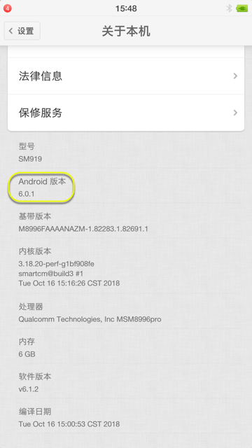
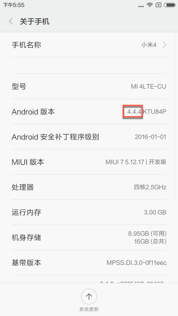

# 相关抓包工具

此处整理，和Charles抓包期间所用到的相关工具的情况。

之前折腾harles去抓包app期间，涉及过的各种工具有：

## 安卓的移动端

* 安卓模拟器
  * 安卓`4.4.2` 的 `夜神模拟器`Mac版
  * 安卓`6.0.1` 的 `网易MuMu` Mac版
* 安卓真机
  * 安卓`6.0.1` 的 `锤子M1L`
    * 
  * 安卓`4.4.4` 的 `小米4`
    * 
    * 注：
      * 淘宝买的二手小米4，已root
      * MIUI版本：`MIUI 7`

### 网易MuMu中Charles有关的心得

#### 设置了Wifi代理后，会导致重启MuMU时无法启动，卡死在99%

* 问题背景：给网易MuMU设置了Wifi代理为Mac中的Charles的代理后，重启MuMU，会卡死在99%
* 解决办法：关于Charles
  * 如需使用Charles，等MuMu正常启动完毕后，再运行Charles

#### 网易MuMu中设置Wifi代理为Charles

旧版本网易MuMu无法设置Wifi代理，现在新版已经可以正常设置Wifi代理（为Charles）了

## Xposed类框架

* [Xposed框架](https://book.crifan.org/books/android_re_xposed_framework/website/)
  * 免root的，类Xposed的框架
    * [VirtualXposed](https://book.crifan.org/books/android_re_xposed_framework/website/xposed_intro/similar/virtualxposed.html)
    * [太极](https://book.crifan.org/books/android_re_xposed_framework/website/xposed_intro/similar/taichi.html)
    * [LSPatch](https://book.crifan.org/books/android_re_xposed_framework/website/xposed_intro/similar/lspatch.html)
