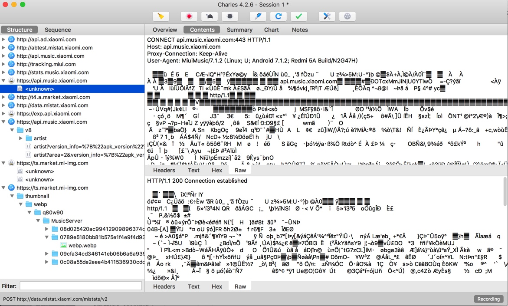
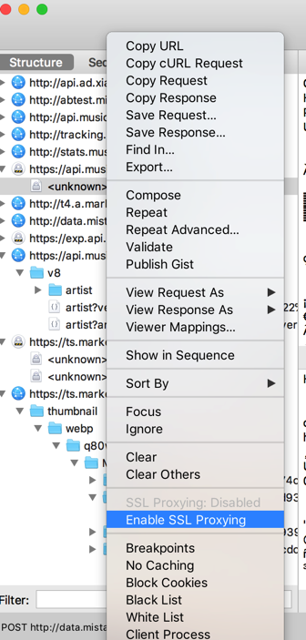
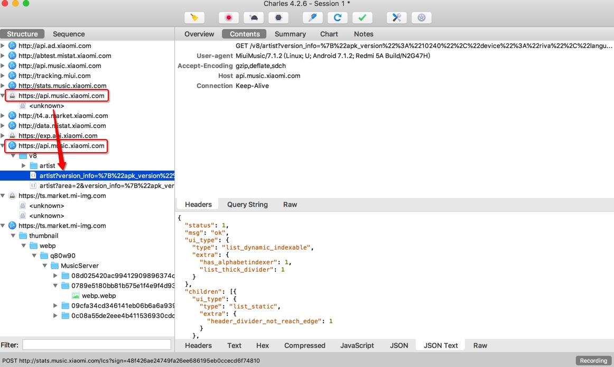
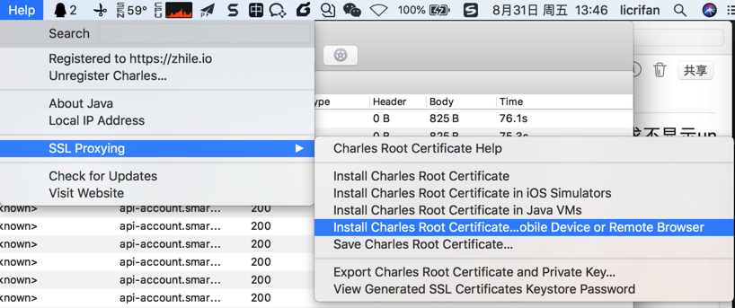
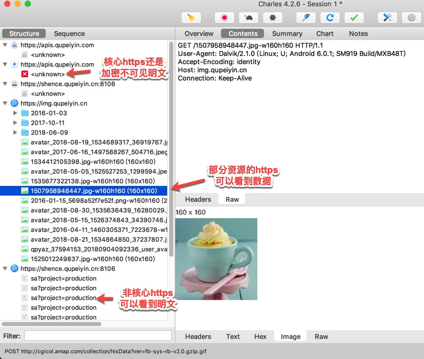

# Charles抓包https的一些心得

## 可以针对单个请求开启SSL

在去给移动端安装ssl证书后：

刚开始没有开启SSL时，对于某个https的链接：

https://api.music.xiaomi.com

抓包显示的是`unknown`：



右键 -> `Enable SSL Proxying` 去开启SSL：



后，就可以看到https的明文了：



## Charles自带解释如何在移动端安装ssl证书

通过Charles的：

`Help -> SSL Proxying -> Install Charles Root Cerificate on Mobile Device or Remote Browser`



则会自动弹出解释：

```bash
Configure your device to use Charles as its HTTP proxy on 10.108.129.57:5678, then browse to
chls.pro/ssl to download and install the certificate.
```

的，意思就是：

手机端，在设置了Wifi代理是Charles后，去打开：

chls.pro/ssl

则可下载和安装证书了。

## 都设置好了但还是无法看到https的明文

如果按照前面都配置好后，但看到的https都还是加密的数据，还是看不到https的明文。那么：

### 看到的往往是https的资源文件

比如：



就是：

* 对于部分https：看到的是红色`unknown`
  * 往往是一些核心api，是我们需要破解和看到明文的
* 对于另外一部分https：可以看到数据
  * 往往是图片等资源文件
* 其他一些https可以看到明文
  * 但是往往不是核心api接口，不是我们需要的

### 如何才能看到https的明文

详见后续需要详细解释的：[破解https的SSL Pinning](../how_capture_app/complex_https/https_ssl_pinning/README.md)
