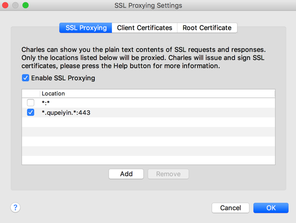
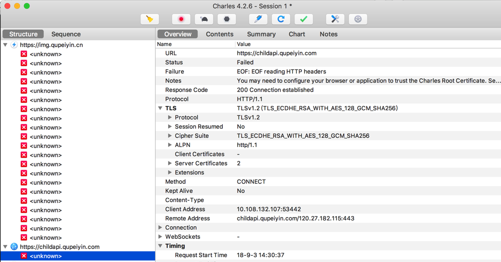

# 过滤请求

如果需要，可以去开启请求的过滤功能。

这样就可以只看到你所关心的特定的请求了。

## 过滤特定api

对于Charles抓包常会遇到一个情况：

默认把所有的api请求都抓出来了，就显得太多太乱，导致想要找到自己关注的那些，不是很容易。

此时，可以去设置过滤特定的api，就可以只显示符合规则的api了。

此处去举例说明：

比如此处只关心：

`https://xxx.qupeiyin.xxx/xxx`

的api地址，则可以去设置：

* Host:`*.qupeiyin.*:`
* Port：`443`
  * 因为https的端口都是443

则就可以只显示对应的api的请求了：

* https://img.qupeiyin.cn
* https://childapi.qupeiyin.com

等等：

注：此处https接口显示unknown，则是另外的事情了。需要后续去解决[破解https的SSL Pinning](http://book.crifan.com/books/app_capture_package_tool_charles/website/how_capture_app/complex_https/https_ssl_pinning.html)
