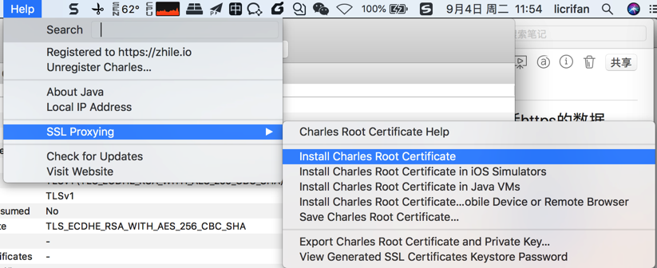
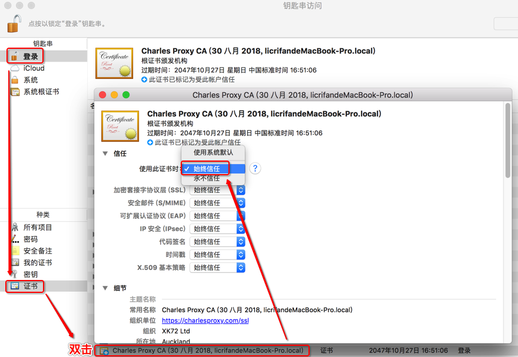

# 复杂的https请求

接着介绍如何用Charles，配合其他相关工具，如夜神安卓模拟器，XPosed框架或太极Magisk框架，以及插件JustTrustMe等，去实现抓包app中加了密的https的请求，即绕过https，看到明文的数据。

## Charles抓包移动端app的https请求的流程

核心步骤和思路：

* 电脑中
  * 安装Charles的根证书
    * Mac
      * 用钥匙串去信任Charles的根证书
  * Charles中
    * 启用 `Enable SSL Proxying`
      * 再设置对应的过滤api地址
* 手机
  * app中
    * 安装Charles的根证书
      * 注意类型选择为：`VPN和应用`
        * 不要选择：WLAN
      * 确保证书安装成功
        * `受信任凭据 -> 用户` 中可以看到已安装的Charles证书

下面详细介绍如何操作。

### Charles中开启SSL代理

`Proxy -> SSL Proxying Settings -> SSL Proxying -> Enable SSL Proxying`

然后去点击`Add`，设置为：

* Host: `*`
* Port: `*`

设置后是：

* `Location`: `*:*`
  * 表示：针对所有的`https`的请求都`启用SSL代理`
    * 这样所有的https的请求，都可以看到解密后的明文了

### 电脑中安装并信任Charles根证书

此处以Mac为例，解释如何在Mac中安装Charles根证书，并设置信任。

通过Charles中的帮助，把Charles的根证书安装到当前电脑中

点击Charles的

`Help -> SSL Proxying -> Install Charles Root Certificate`

会弹出 （调用Mac的）钥匙串KeyChain Access，去其中设置信任Charles的根证书：

即可看到证书从`红色`变`蓝色➕`加号的：

`此证书已标记为受此账户信任`

### 移动端安装Charles的ssl证书

接着就是去移动端的手机中安装Charles的ssl证书。

核心步骤：

* 得到Charles的手机端的证书
  * 有两种方式
    * 自己下载
      * 手机端打开`http://chls.pro/ssl`，会自动弹框去下载得到ssl证书
        * 比如：`charles-ssl-proxying-certificate.pem`
        * 注意：事先要给手机端设置好Charles的代理，否则只能打开和看到普通网页，无法弹框下载
    * 从别处拷贝
      * 从PC端Charles导出手机端要安装的证书
        * 比如：`charles-ssl-proxying-certificate.cer`
      * 别人下载好的 或 你自己之前下载好的，拷贝或发送到手机端
* 去安装证书
  * 直接点击即可开始安装
    * 如果不行，则通过`从存储设备安装`去安装，确定是可以安装的
  * 安装期间的设置
    * 凭据类型：`VPN和应用`
      * 不能选`WLAN`
  * 安装完毕后确定安装成功
    * `受信任的凭据 -> 用户` 中可以看到已安装`XK72 Ltd Charles Proxy CA`字样的证书

详细过程：

详见后续的：[移动端安装Charles的ssl证书](http://book.crifan.com/books/app_capture_package_tool_charles/website/how_capture_app/complex_https/mobile_install_ssl_ca.html)