# 已root的安卓+Xposed+JustTrustMe破解ssl pinning

接下来详细，如何在已`root`的`安卓`中，借助`Xposed`和`JustTrustMe`，去实现绕开https证书校验，实现抓包https得到明文数据。

## 准备好已root的安卓

对于想要获取已root的安卓，有两种方式：

* 对于安卓`真机`来说
  * 很久之前是很简单的事情
    * 随便买个安卓手机，都容易去`root`
  * 现在
    * 大多数手机品牌（小米，华为等）新买到的都是安卓新版本
      * 比如：`Android 8.0`， `Android 9.0`之类的
    * 且都很难root
      * 都要向官方申请，要等很长时间（以月为单位）
        * 申请先解锁`BL`=`BootLoader`
        * 然后才能root
      * 而且最后还未必通过
    * 结论就是：
      * 现在很难买到能root的新安卓手机了
  * 所以
    * 最终方案是：
      * 去淘宝买个二手的已root的安卓手机
        * 比如：400元左右的
          * [二手小米4](https://search.taobao.com/search?q=%E4%BA%8C%E6%89%8B%E5%B0%8F%E7%B1%B34&commend=all&ssid=s5-e&search_type=item)
            * 型号：`MI 4 LTE-CU`
            * 安卓系统版本：`Android 4.4.4`
* 对于安卓`模拟器`来说
  * Mac中也有很多安卓模拟器
    * 目前测试能用的有
      * `夜神Nox`安卓模拟器
        * 模拟的是：`Android 4.4.2`
      * `网易MuMu`安卓模拟器
        * 模拟的是：`Android 6.0.1`
    * 其他不能用，不好用的有
      * Andy：安装后无法正常运行
      * 天天模拟器：没有我要的Mac版
      * Genymotion：收费的，还要麻烦的去破解，暂时懒得继续试
      * BlueStacks：只支持Win，不支持Mac，且也比较老旧

如前所述，已root的安卓，可以选用：

* 安卓真机
  * 二手小米4：`Android 4.4.4`
* 安卓模拟器
  * 夜神模拟器：`Android 4.4.2`
  * 网易MuMu：`Android 6.0.1`

中的任何一个。

此处以Mac中的`夜神模拟器`为例去解释。

* Mac版 夜神模拟器 Nox App Player
  * 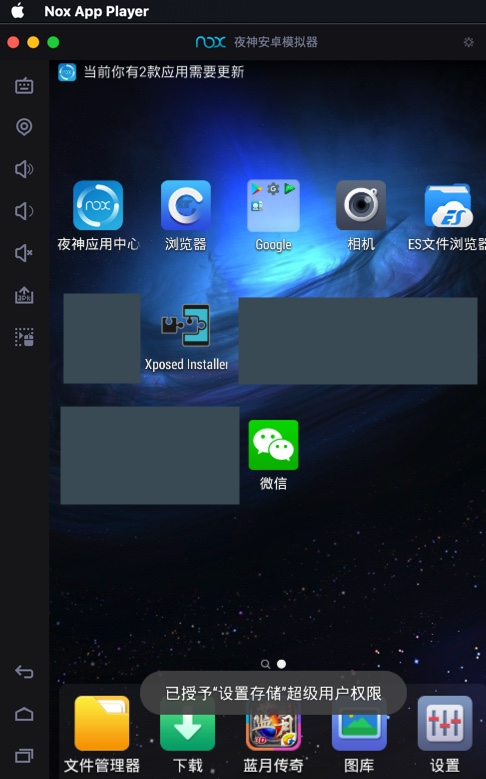
* 已经root了
  * 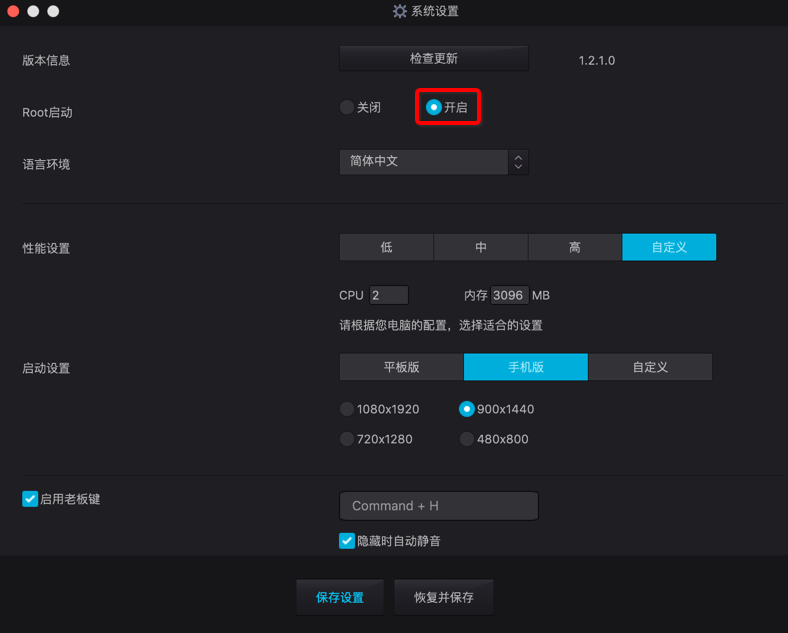
* 模拟的是：Android 4.4.2
  * 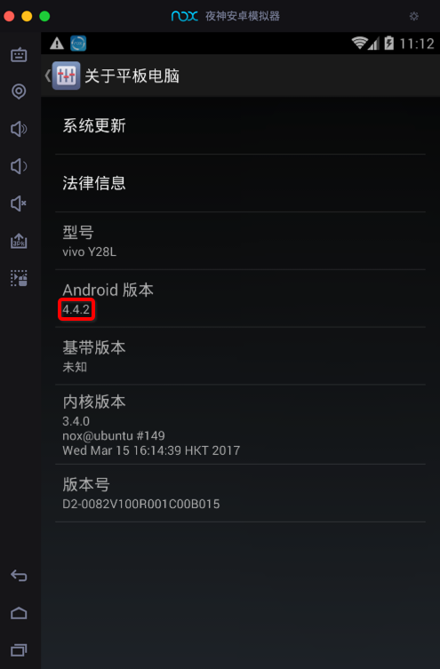

> [!TIP|title:夜神模拟器]
> 关于夜神的更多解释详见：
> 
> [好用的安卓模拟器：夜神Nox](https://book.crifan.org/books/good_android_emulator_nox/website/)

## 安装Xposed框架

在已root的安卓中，安卓Xposed框架。

根据[Xposed官网](https://repo.xposed.info/module/de.robv.android.xposed.installer)解释，Xposed的版本和安卓版本需要对应，否则无法正常安装和使用：

* `Android 4.0.3` ~ `Android 4.4`
  * 用`v2.7`, `v2.6.1`的`Xposed installer`
    * 支持：此处基于`Android 4.4.2`的夜神安卓模拟器
* `Android 5`以上
  * 用`3.x`版本的`Xposed installer`
    * 比如：[3.5.1](http://forum.xda-developers.com/showthread.php?t=3034811)

下面介绍在夜神模拟器中安装Xposed的详细步骤：

下载`v2.7`的xposed installer的[de.robv.android.xposed.installer_v33_36570c.apk](https://dl-xda.xposed.info/modules/de.robv.android.xposed.installer_v33_36570c.apk)：

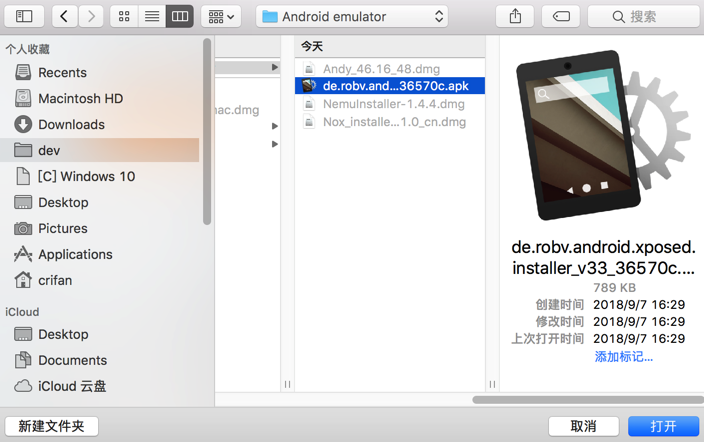

然后拖动到夜神模拟器中，即可自动安装，安装完毕后，可以在桌面上看到：

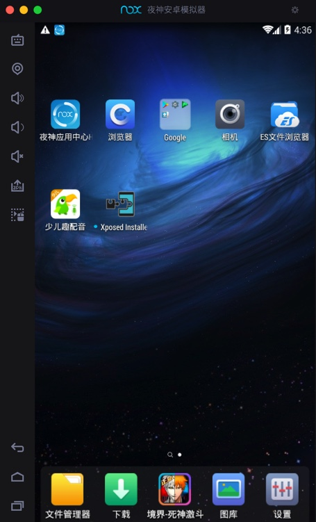

接着点击进入`Xposed Installer`，再去安装`Xposed框架`到安卓系统中：

点击 `安装/更新`，在弹框中对于 超级用户请求，设置`永久记住选择`：

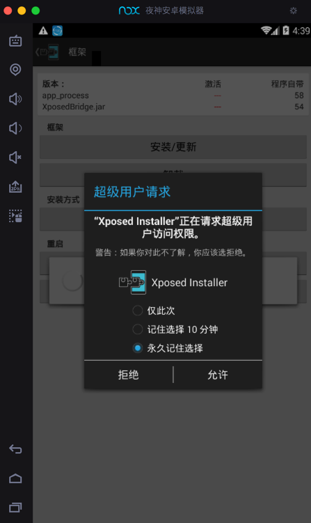

然后会去安装到系统中，再点击`确定`去重启：

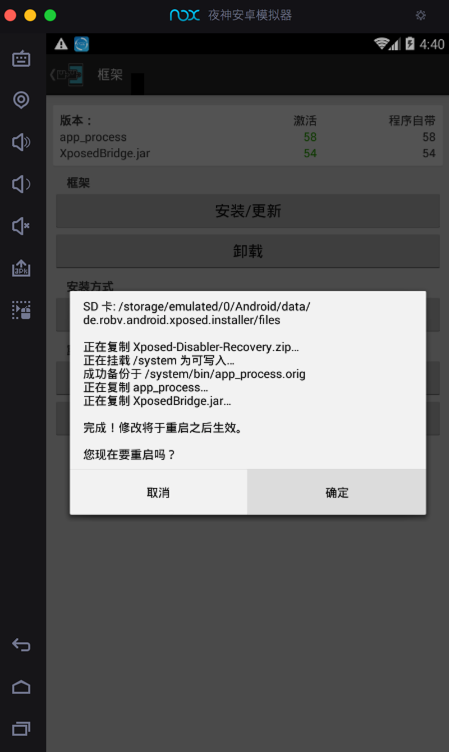

重启后，看到Xposed框架中显示：

```bash
app_process 激活 58 程序自带 58
XposedBridge.jar  激活 54 程序自带 54
```


表示Xposed框架已激活，可以继续使用了。

> [!TIP|title:Xposed框架]
> 关于Xposed框架的更多解释详见：
> 
> [安卓逆向调试：XPosed框架](https://book.crifan.org/books/android_re_xposed_framework/website/)

## 安装JustTrustMe

再去下载和安装JustTrustMe：

去[JustTrustMe的GitHub的release](https://github.com/Fuzion24/JustTrustMe/releases)下载[JustTrustMe.apk](https://github.com/Fuzion24/JustTrustMe/releases/download/v.2/JustTrustMe.apk)

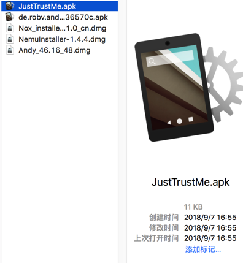

像安装普通安卓apk一样，拖动进去，即可把`JustTrustMe.apk`安装到夜神模拟器中。

注意：此`JustTrustMe`没有app界面，所以安卓后，也没有`打开`之类的操作。而只能是，去Xposed中才能看到和激活此应用。

然后去Xposed中找到并勾选以激活`JustTrustMe`：

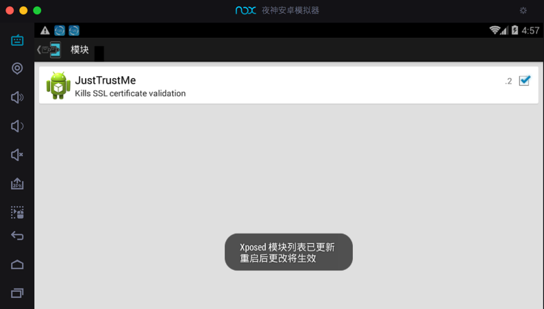

然后记得重启Xposed：

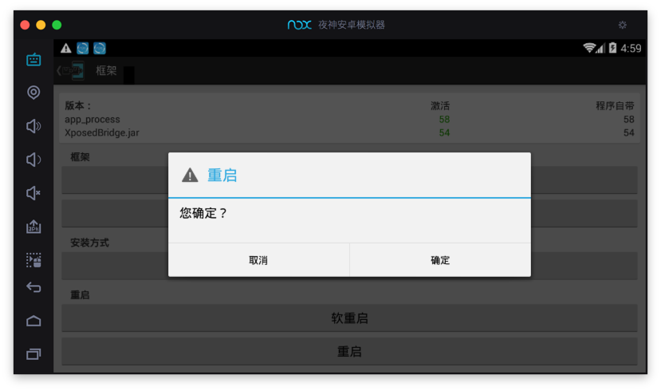

## Charles抓包可以看到https明文

然后再去用Charles抓包：

对于之前没有启动https的，抓包https看到的都是`unknown`的请求和数据是加密的乱码：

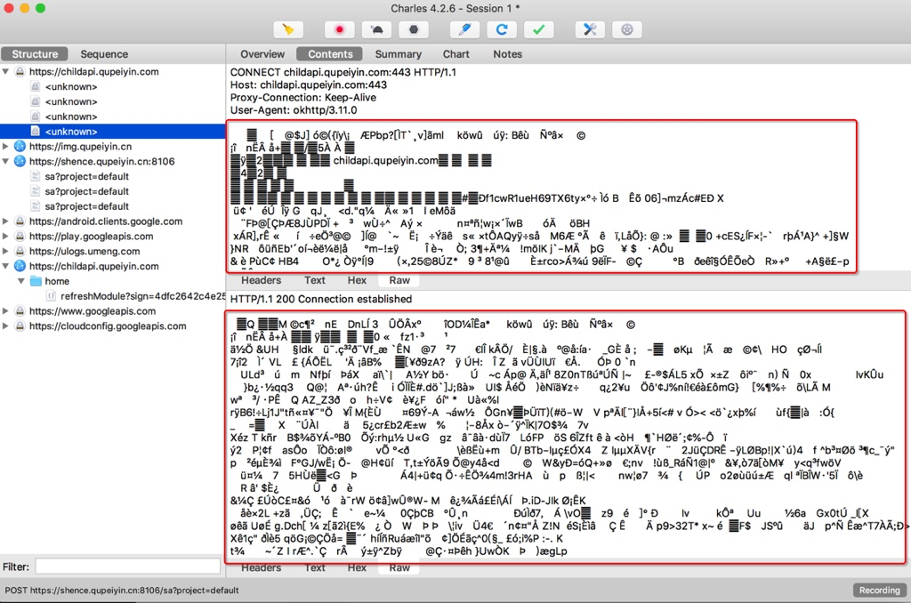

现在，即可绕开app的https的证书校验，从而可以看到明文数据了：

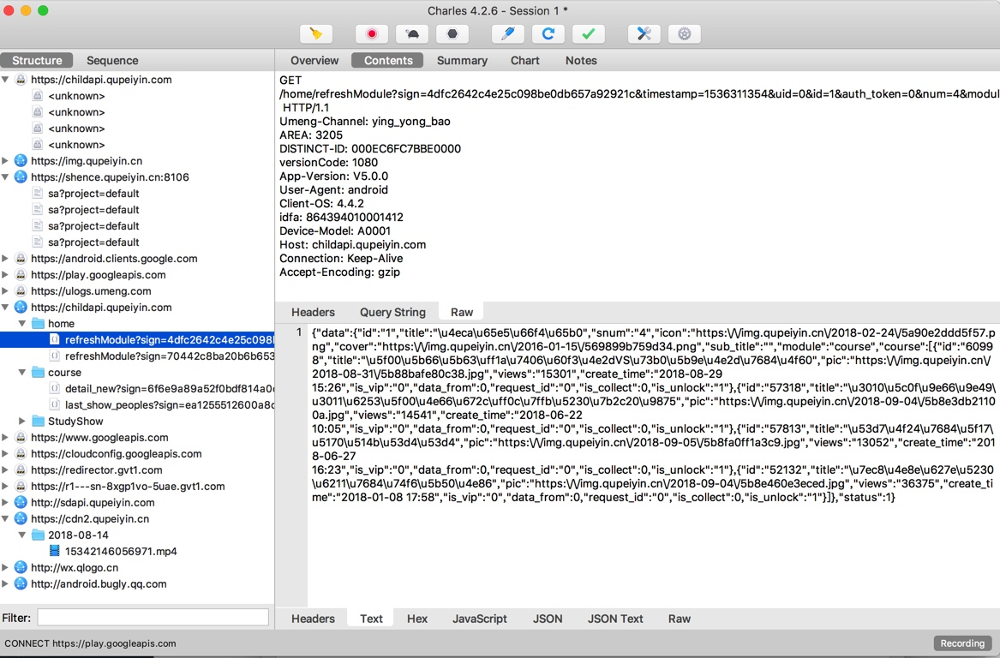
