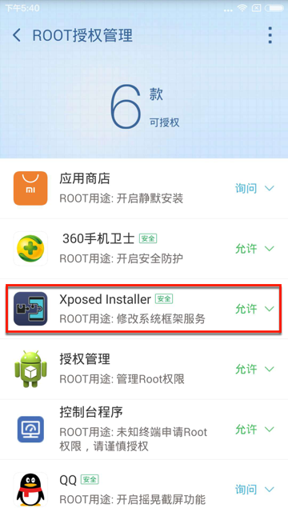

# 破解https的ssl pinning心得

## 已root二手小米4安装XPosed

淘宝上买的[二手的已root的小米4，MI 4LTE-CU，Android 4.4.4](https://item.taobao.com/item.htm?id=570638208316)

在无端被`MIUI`自动升级，从`MIUI 5.8.5`升级为`MIUI 7.5.12.17`），导致：

* 丢失了root权限
* 丢失了卖家原先已安装好的Xposed Installer

需要再去想办法：

* 重新获取root权限
  * 用360超级Root去重新root
    * 
* 重装可用的Xposed
  * 也是费了番功夫的
    * 重新安装，会报错：`Xposed目前不兼容Android SDK版本19或您的处理器架构armeabi-v7a`
      * 试了N多个版本，都不行
    * 最后是从[这里](https://forum.xda-developers.com/showpost.php?p=64063168&postcount=62)找到了大神`SolarWarez`修改后的`v2.6`的版本的730KB的`Xposed`：
      * `XposedInstaller_v2.6.1_by_SolarWarez_20151129.apk`
      * 或
      * `XposedInstaller_v2.6.1_MIUI_edition_by_SolarWarez_20151129.apk`
    * 才得以正常安装和使用XPosed