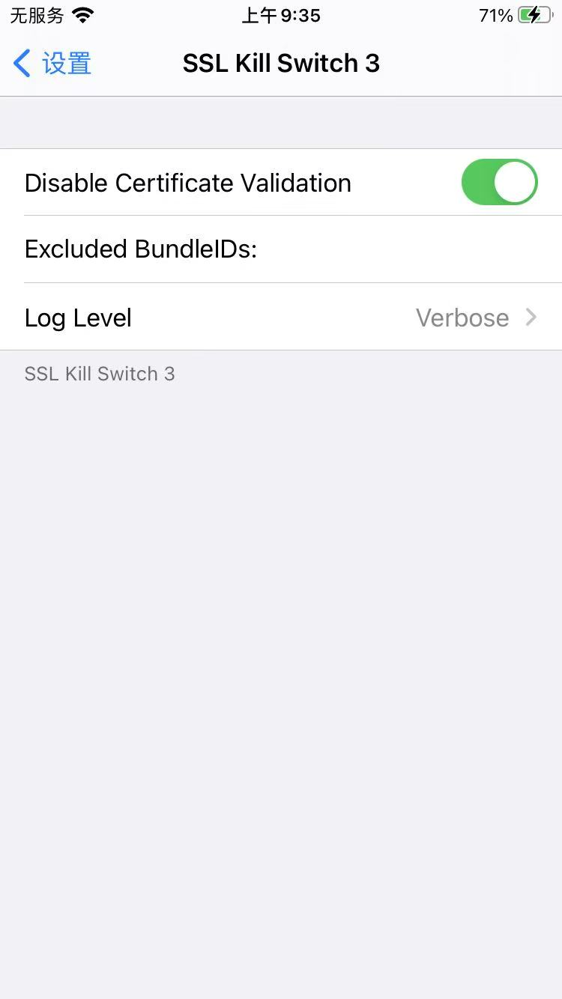
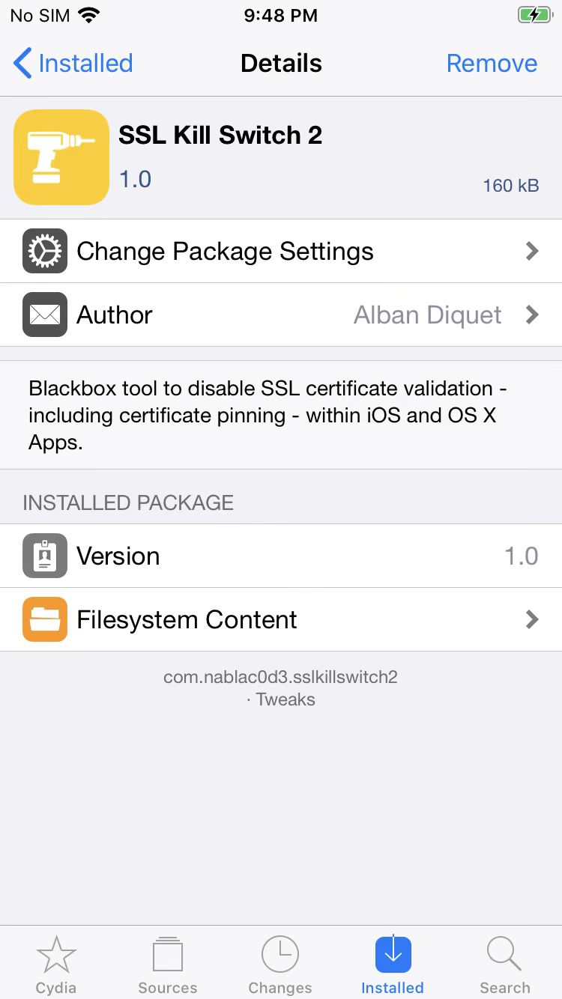
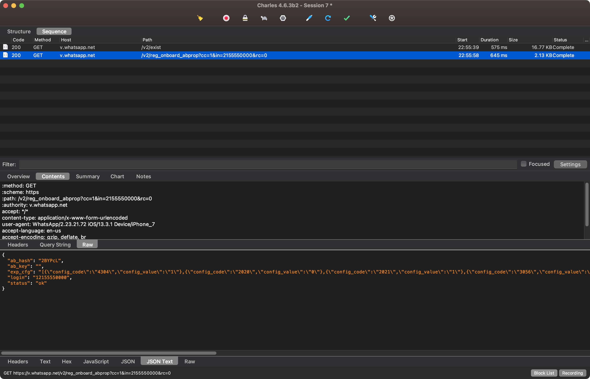
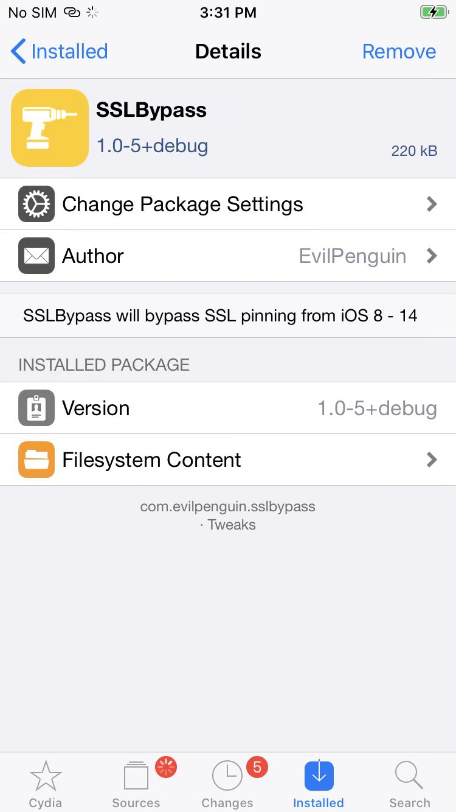
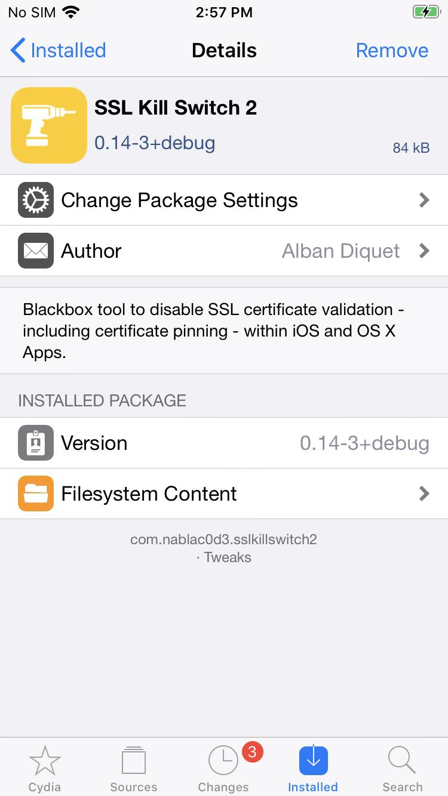

# iOS端

* 前提
  * iOS：已越狱
    * 确保后续能安装`Cydia`/`Sileo`等包管理器
* 绕过SSL pinning的工具
  * 插件=tweak=越狱插件
    * 最好用的是：`NyaMisty/ssl-kill-switch3`
      * Repo源地址
        * https://repo.misty.moe/apt/
      * 下载地址
        * https://github.com/NyaMisty/ssl-kill-switch3
          * https://github.com/NyaMisty/ssl-kill-switch3/releases
            * [v1.5.1](https://github.com/NyaMisty/ssl-kill-switch3/releases/tag/v1.5.1)
              * **rootfull**
                * [moe.misty.sslkillswitch3_1.5.1+rootful_iphoneos-arm.deb](https://github.com/NyaMisty/ssl-kill-switch3/releases/download/v1.5.1/moe.misty.sslkillswitch3_1.5.1+rootful_iphoneos-arm.deb)
              * roothide
                * [moe.misty.sslkillswitch3_1.5.1+roothide_iphoneos-arm64e.deb](https://github.com/NyaMisty/ssl-kill-switch3/releases/download/v1.5.1/moe.misty.sslkillswitch3_1.5.1+roothide_iphoneos-arm64e.deb)
              * rootless
                * [moe.misty.sslkillswitch3_1.5.1+rootless_iphoneos-arm64.deb](https://github.com/NyaMisty/ssl-kill-switch3/releases/download/v1.5.1/moe.misty.sslkillswitch3_1.5.1+rootless_iphoneos-arm64.deb)
      * 注意：安装后要开启才能使用
        * `设置`->`SSL Kill Switch 3`->勾选=开启：`Disable Certificate Validation`
          * 
      * 插件详情
        * rootfull
          * 
      * 效果
        * WhatsApp的https请求可以看到明文
          * https://v.whatsapp.net
            * 
        * Apple的相关请求也可以看到明文
          * https://gateway.icloud.com.cn
            * 
    * 其次是：`evilpenguin/SSLBypass`
      * 下载地址
        * https://github.com/evilpenguin/SSLBypass
          * https://github.com/evilpenguin/SSLBypass/blob/main/packages/com.evilpenguin.sslbypass_1.0-5%2Bdebug_iphoneos-arm.deb
      * 插件详情
        * 
    * 再次是：`nabla-c0d3/ssl-kill-switch2`
      * 下载地址
        * https://github.com/nabla-c0d3/ssl-kill-switch2
          * https://github.com/nabla-c0d3/ssl-kill-switch2/releases
            * https://github.com/nabla-c0d3/ssl-kill-switch2/releases/download/0.14/com.nablac0d3.sslkillswitch2_0.14.deb
      * 插件详情
        * 
      * 注：
        * 旧版本：[iOS SSL Kill Switch](https://github.com/iSECPartners/ios-ssl-kill-switch)
    * 其他
      * [SSL Kill Switch 2 (iOS 13)](https://julioverne.github.io/)
  * `Frida`的js
    * 绕过证书校验
      * [Frida CodeShare Project: iOS SSL Bypass](https://codeshare.frida.re/@lichao890427/ios-ssl-bypass/)

