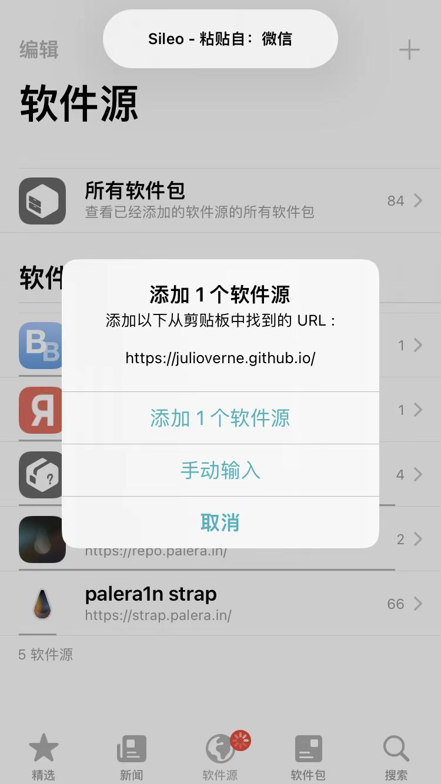
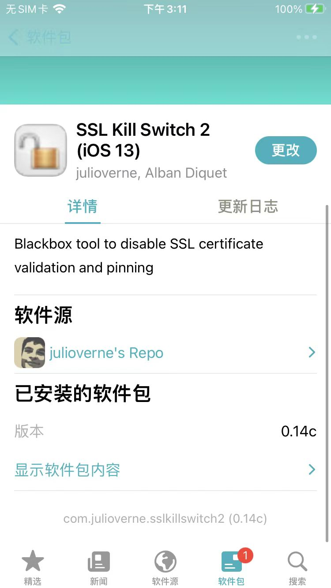
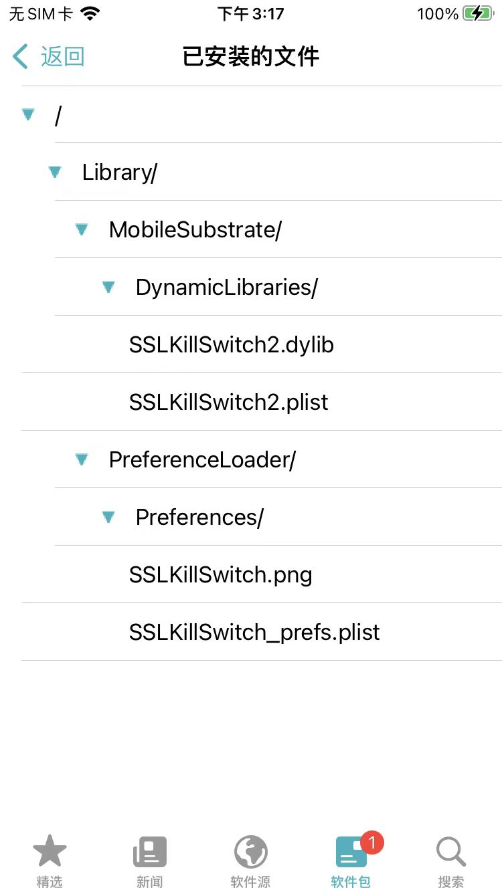
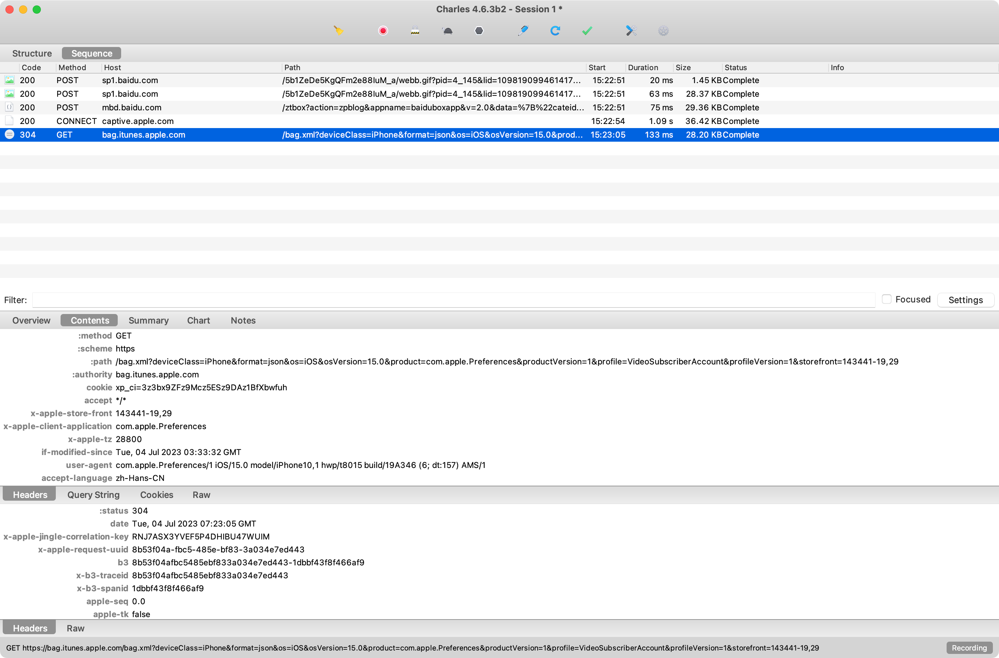
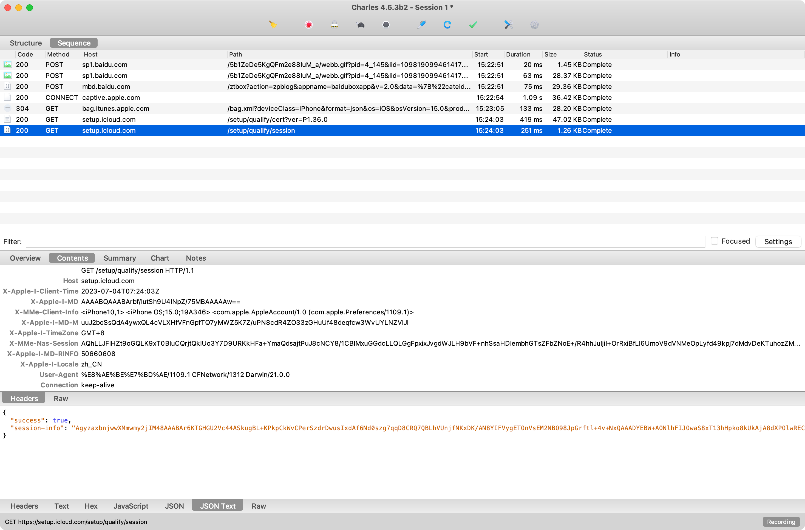
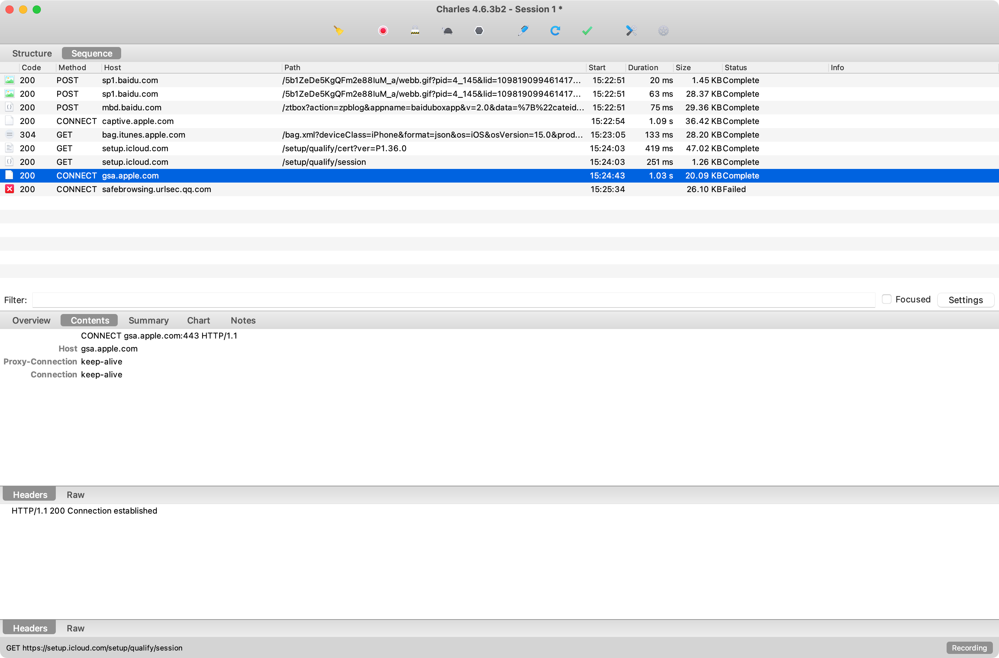

# iOS端

* 前提
  * iOS：已越狱
    * 确保后续能安装`Cydia`/`Sileo`等包管理器
* 辅助实现绕过SSL pinning的工具
  * 插件=tweak
    * [SSL Kill Switch 2 (iOS 13)](https://julioverne.github.io/)
    * [SSL Kill Switch 2](https://github.com/nabla-c0d3/ssl-kill-switch2)
      * 旧版本：[iOS SSL Kill Switch](https://github.com/iSECPartners/ios-ssl-kill-switch)
  * `Frida`的js
    * 绕过证书校验
      * [Frida CodeShare Project: iOS SSL Bypass](https://codeshare.frida.re/@lichao890427/ios-ssl-bypass/)

## 举例

### Apple账号

经测试，Apple账号登录过程中的https请求：

* 除了特殊的，特定的：
  * https://gsa.apple.com
* 之外，其他普通的（包括带账号绑定的https请求），是可以抓包的，能看到明文的
  * 比如：
    * https://setup.icloud.com
    * https://bag.itunes.apple.com

具体步骤：

* 手机
  * iPhone8: `iOS 15.1`、`palera1n`的`rootful`越狱
* Sileo中安装插件
  * `julioverne`的`SSL Kill Switch 2 (iOS 13)`
    * 源地址：https://julioverne.github.io
      * 
    * 插件安装后效果
      * `com.julioverne.sslkillswitch2`(0.14c)
        * 
          * 已安装文件
            * 

https抓包效果：

* 能抓包明文的
  * https://bag.itunes.apple.com/bag.xml
    * 
  * https://setup.icloud.com/setup/qulify/session
    * 
* 无法抓包的
  * https://gsa.apple.com
    * 
      ```bash
      https://gsa.apple.com 
      200 
      CONNECT 
      gsa.apple.com 

      Tue Jul 04 15:24:43 CST 2023 
      1031 
      20568 
      Complete
      ```
