# 安卓中安装Charles的ssl证书的典型步骤

## 通过浏览器下载Charles的ssl证书

在给安卓中 [设置了Wifi代理为Charles](../../../how_capture_app/simple_http/mobile_proxy/android.md) 之后，再去安卓端的浏览器打开：

http://chls.pro/ssl

其会自动跳转到

http://charlesproxy.com/getssl

然后会自动弹框去下载证书文件

注意：**不要用微信**去打开，改用手机中单独的浏览器，比如`QQ浏览器`去打开


## 安装Charles的ssl证书

找到下载好的证书文件：

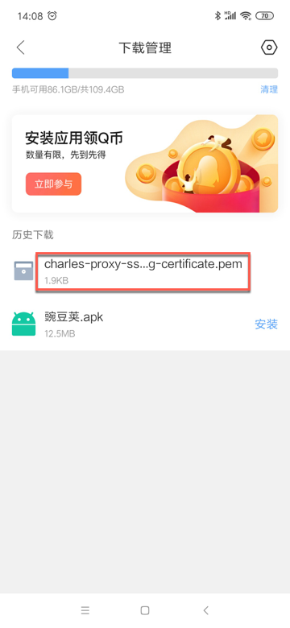

点击去安装，正常情况下，可以弹出用安装证书所用工具。

比如：

* 从微信等方式发送到手机端后点击证书显示的`证书安装工具`
  * 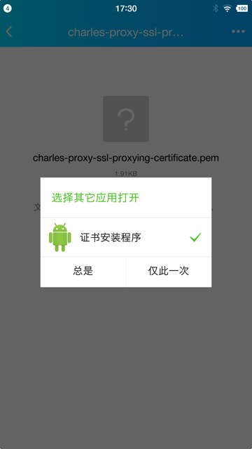
* 小米4中用浏览器下载到`getssl.crt`后点击弹框选择`证书安装工具`
  * 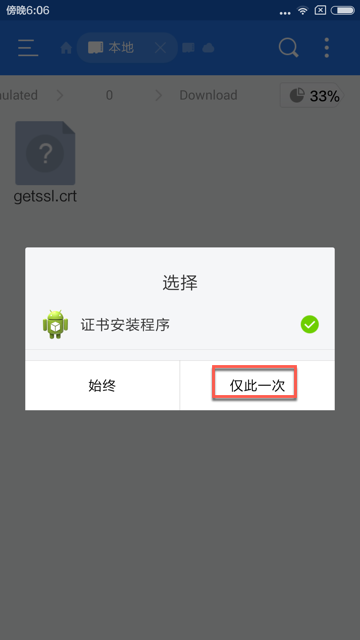

然后后续就是正常的安装证书的过程了。

另外，很多设备真正安装证书之前，需要进入设置PIN码或解锁图案的设置界面，比如：

* 小米9
  * 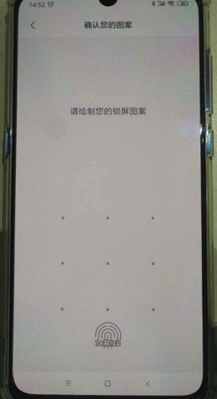
* 小米4
  * 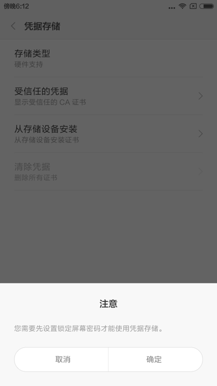
  * 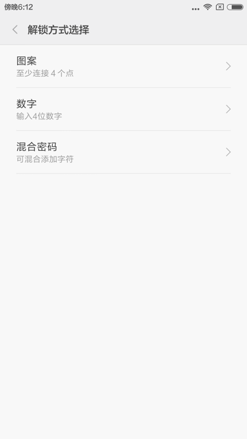
  * 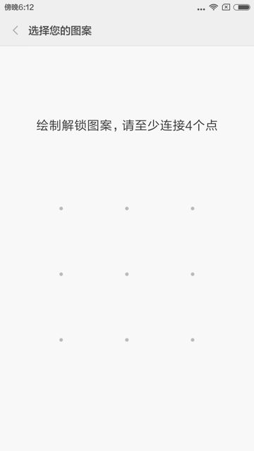

正常的证书安装过程是：

进入`为证书命名`界面，输入证书名：

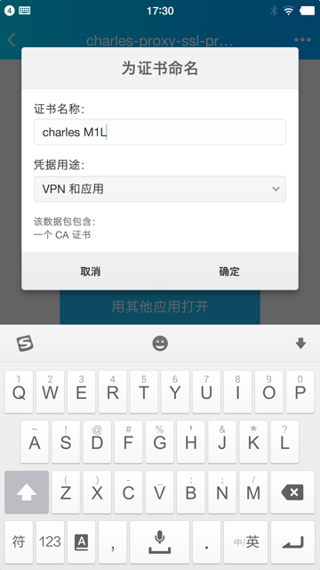

此处是：

* 证书名称：`Charles M1L`
  * 注：
    * 此处可以随意命名
    * 一般命名中包含Charles，更易于后期识别
* 凭据类型：`VPN和应用`
  * 注意：
    * 有两个选项：
    * 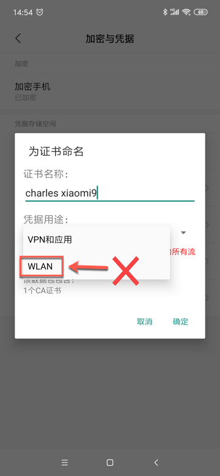
    * **应该**选`VPN和应用`
    * **不要**选`WLAN`
      * 我之前错误理解为：此处Charles代理是用于Wifi，所以要选WLAN

然后就会显示`toast`提示：`已安装 xxx`：


## 确认Charles证书已正确安装

接下来再去确认Charles证书已正常安装：

`受信任的凭据 -> 用户` 中可以看到已安装的证书：

```bash
XK72 Ltd
Charles Proxy CA
```

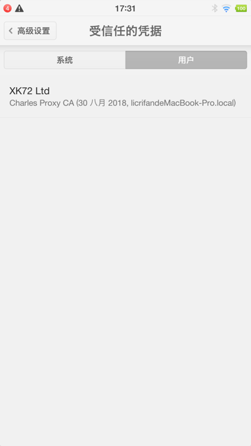

点击后可以看到Charles证书的详情：

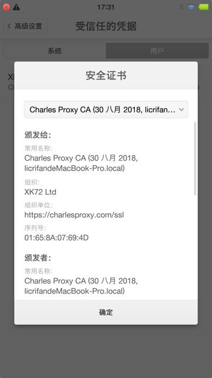

另外，小米9中，还可以通过`用户凭据`中看到已安装的证书：

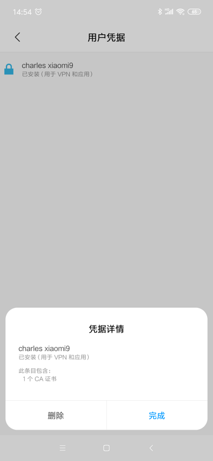

