# 移动端安装Charles的ssl证书的心得

## 手机中安装了ssl证书后

### 会导致手机不安全，系统会有安全警告，如果后续不用，记得删除掉

成功安装Charles的ssl证书后，导致增加了`中间人攻击`的风险，手机变得不够安全，所以系统会有安全提示：

`网络可能会受到监控 受到不明第三方的监控`

比如：

* 小米4
  * 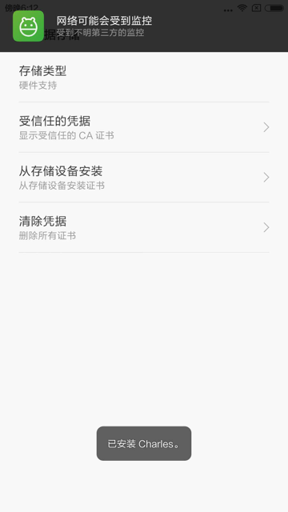
* 某安卓真机
  * 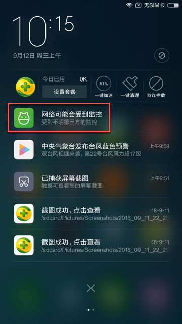
  * 点击后，可以查看到对应的证书，即此处的Charles证书
    * 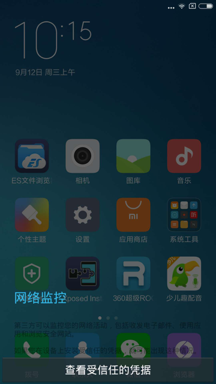
    * 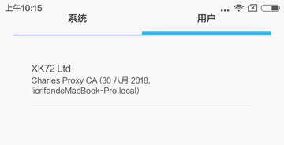
* 网易MuMu安卓模拟器
  * 
  * 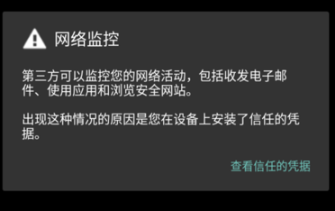
  * 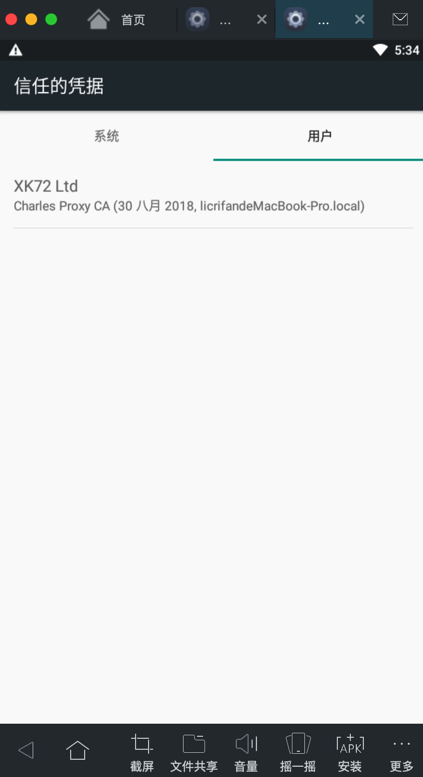

所以：如果在你调试抓包完毕之后，不再抓包时，记得卸载掉手机中的CA证书：

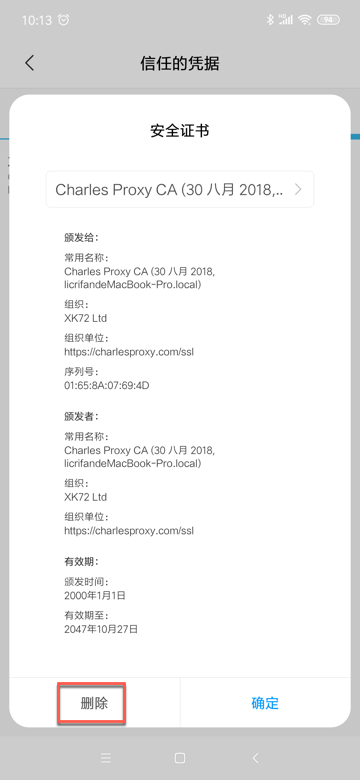

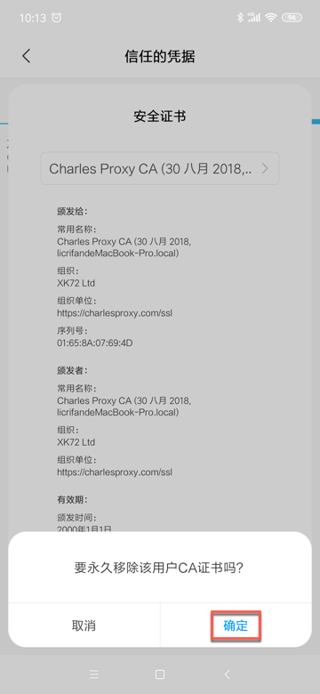

让手机恢复安全。

### 部分应用的H5页面会有警告和提示

目前已经发现的有：

* 小米9 安卓9.0
  * 安装了Charles的ssl证书后
    * 京东app
      * 打开H5页面会提示
        * `当前网站证书不可信且证书链长度为1，可能是服务器没有配置完整证书链，是否信任并继续访问？`
        * 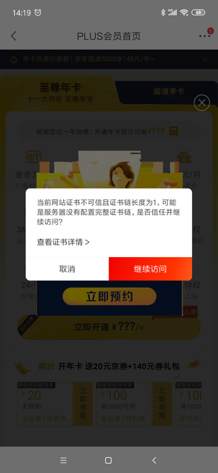
          * 点击后，可以看到的确是Charles的证书
            * 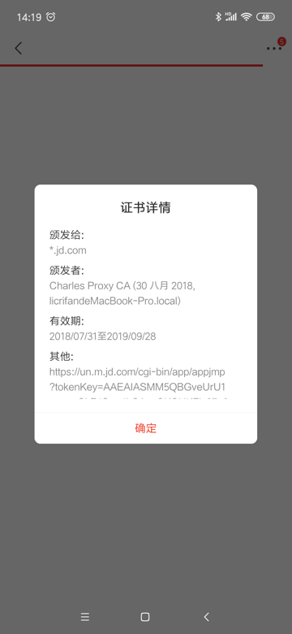
          * 有时候此警告会频繁跳出，点击关闭的速度都赶不上跳出警告的速度，导致无法正常继续查看页面内容
    * 支付宝app
      * 在用支付宝支付时，会弹出当前支付环境不可信，是否继续支付 之类的提示
        * 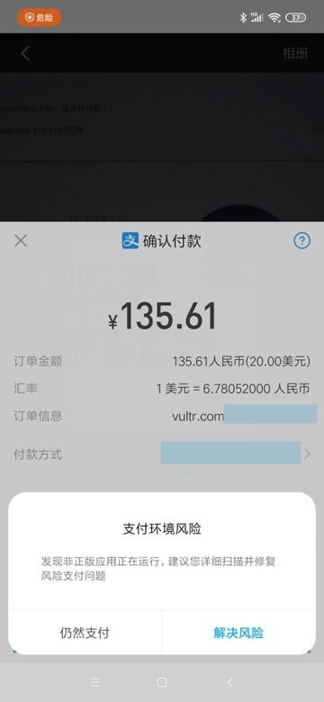

## 要先设置手机中Wifi代理为Charles后才能下载到ssl证书

在手机端浏览器打开：

http://chls.pro/ssl

去下载ssl证书文件之前，千万记得要去手机端给Wifi设置Charles的代理，才可以。

否则就会显示出普通的网页，而不会出现弹框和下载证书文件。

而无法看到，弹出下载文件的弹框的，无法下载到证书文件。

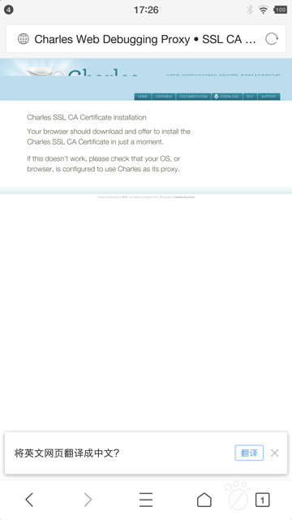

## 不同移动端下载到的证书名和格式不太相同

经过多次的折腾而了解到，不同的移动端

* 真机：小米4
* 真机：小米5，红米5A
* 模拟器：网易MuMu Mac版
* 模拟器：夜神 Mac版

等，在浏览器打开

http://chls.pro/ssl

会自动弹框，去下载到的Charles的ssl证书，不同手机端往往有不同的文件名和后缀。

典型的有：

* 真机：`锤子M1L Android 6.0.1`
  * pem文件：`charles-ssl-proxying-certificate.pem`
    * 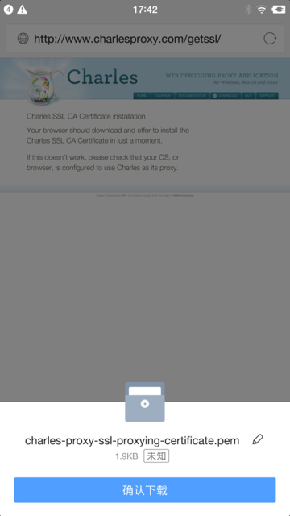
* 真机：`小米9 Android 9.0`
  * pem文件：`charles-ssl-proxying-certificate.pem`
    * 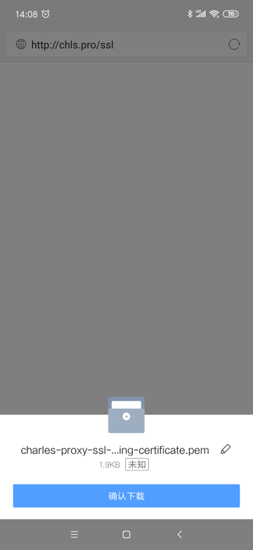
* 真机：`小米5`，`红米5A`，`小米4`
  * 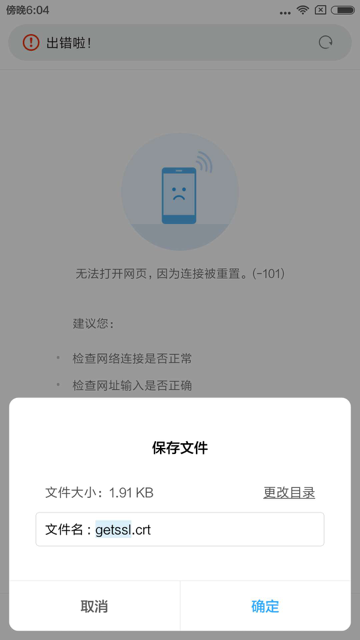
  * crt文件：`getssl.crt`
    * 注：
      * 后来无法正常安装此`getssl.crt`证书
      * 而改用之前已下载的`charles-ssl-proxying-certificate.pem`才成功安装到小米4中
* 模拟器：`网易MuMu`
  * crt文件：`downloadfile.crt`
* 模拟器：`夜神` Mac版
  * 直接跳出证书安装界面
    * 不知道，也无需知道证书文件名

目前的理解是：

-》好像是crt和pem的证书文件内部格式是不同的。

-》不过，不论是crt还是pem，都是可以正常安装证书的。

## 可直接安装证书而并非一定要去下载

对于手机端去安装Charles的ssl证书来说

其实不一定非要根据官网说的，通过浏览器打开

http://chls.pro/ssl

去弹框下载ssl证书文件，再去安装。

而只要得到了Charles的ssl证书文件，即可直接点击去安装即可。

而得到Charles的ssl证书的方法，可以：

* 直接把之前下载过的证书文件
* PC端Charles导出的证书文件

发送到手机端即可，然后再安装就行了。

比如：把之前小米9中浏览器下载到的pem证书：

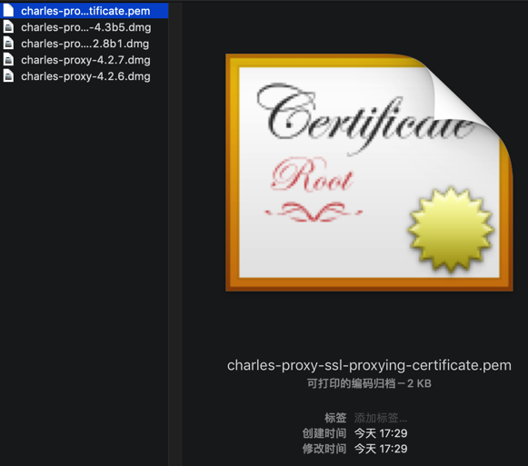

（此处通过微信或QQ去）发送到手机，比如锤子M1L，中：

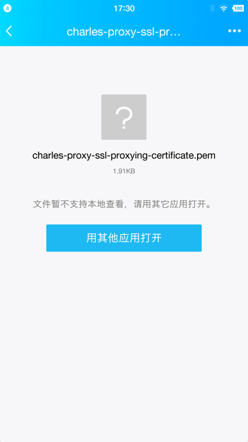

然后点击去安装证书，后续流程和前面标准过程中就是一样的了。

### PC端用Charles导出的ssl证书文件

可以通过PC端的Charles去导出ssl证书文件：

`Help -> SSL Proxying -> Save Charles Root Certificate`

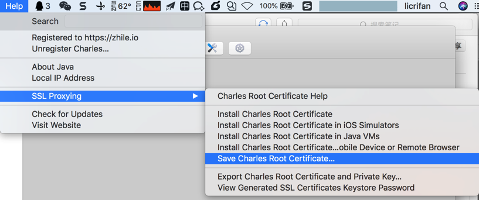

导出得到`pem`文件：

`charles-ssl-proxying-certificate.pem`

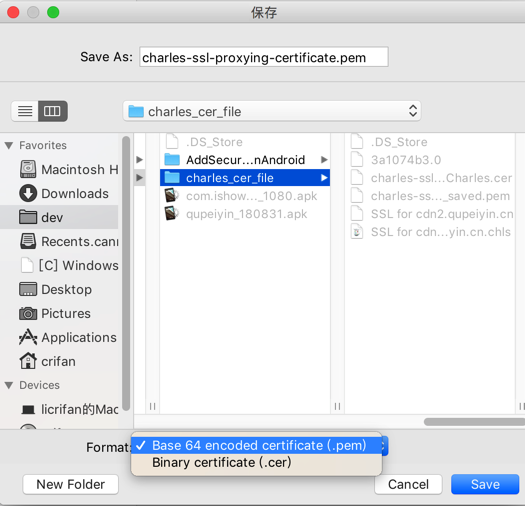

从图中可以看出，也可以导出`cer`格式的证书文件的。

## 用某些方式无法正常安装证书

有时候会遇到证书无法正常安装

此时，对应的位置就没有证书：

`受信任的凭据 -> 用户` 是空的：

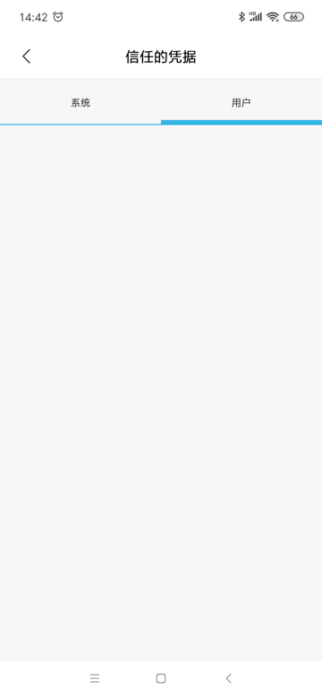

`用户凭据`中也是空的：

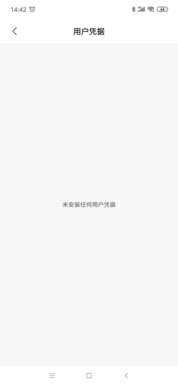

下面整理一些无法安装证书的情况：

### 直接点击证书却无法识别和安装

有些手机系统中，直接点击Charles的ssl证书文件，却无法识别和安装

比如小米9中QQ浏览器点击`pem`证书文件，结果只弹出了爱奇艺，而不是开始安装的界面：

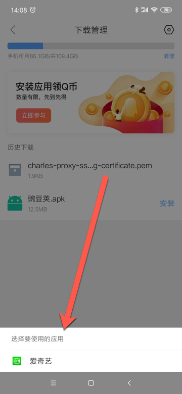

### 直接从系统设置中搜索到的安装证书是无法直接点击安装的

之前在已下载证书文件（但是应该是没有把证书放到特殊指定位置），然后只是通过安卓系统的设置中，搜索出相关证书选项。

然后去点击安装时，都是无法找到并安装证书的：

比如，小米9中的设置中：

* 搜`安装证书`，点击`安装证书`，提示`没有可安装的证书`
  * 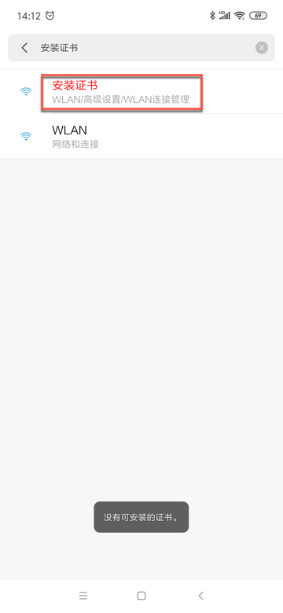
* 搜`安装`，点击`从存储设备安装`，提示`没有可安装的证书`
  * 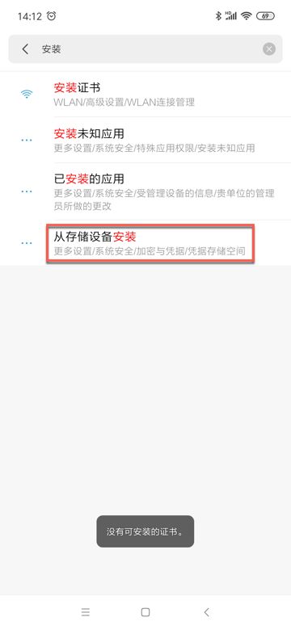

### 有时候从ES文件管理器中点击证书选择证书安装程序去安装都无效

此处还遇到很奇怪的，小米9中，用ES文件管理器，找到已下载的证书了。

选择`其他`方式去打开：

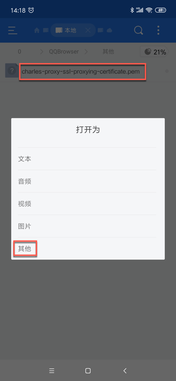

再去选，觉得应该可以的，`证书安装程序`：

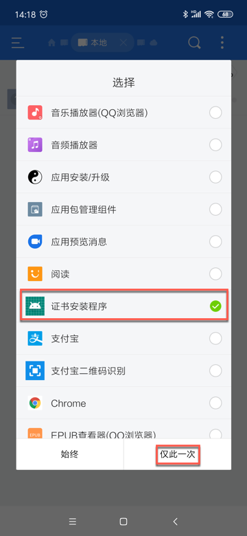

结果都没任何反应，证书最终都没有正确安装。

## 如果无法安装证书，则可以通过`从存储设备安装`去安装

如果遇到（前面几种方式）无法安装证书时，可以考虑通过系统设置中的`从存储设备安装`去安装。

比如：

* 小米9中是：`设置 -> 更多设置 -> 系统安全 -> 加密与凭据 -> 从存储设备安装`
  * 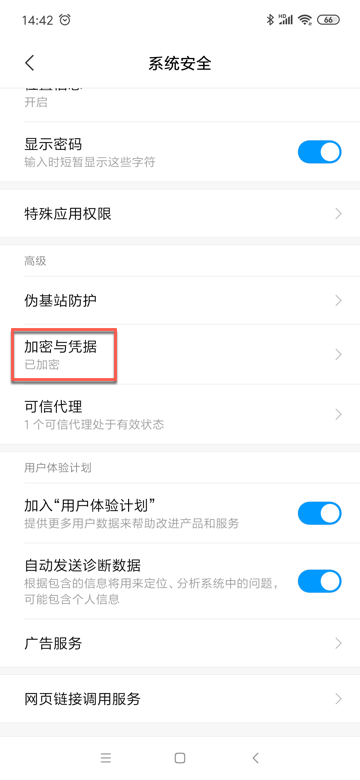
  * 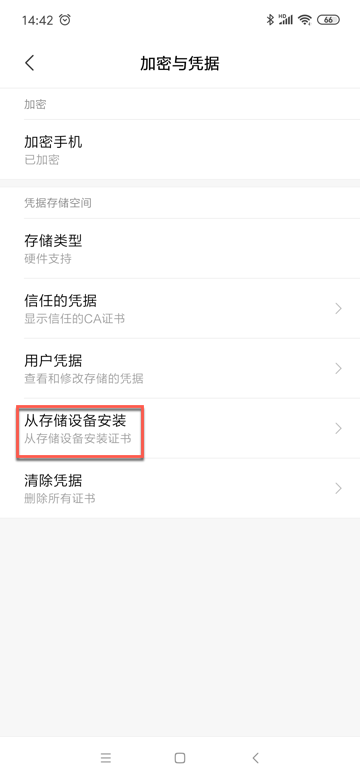
* 小米4中是：`设置 -> 其他高级设置 -> 安全和隐私 -> 凭据存储 -> 从存储设备安装`
  * 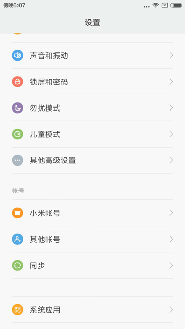
  * 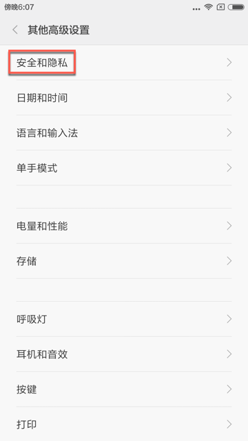
  * 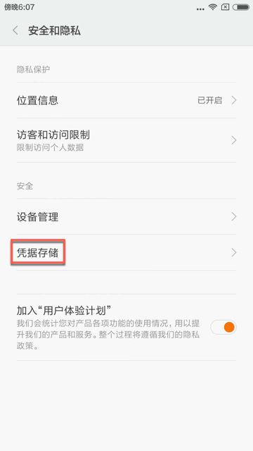
  * 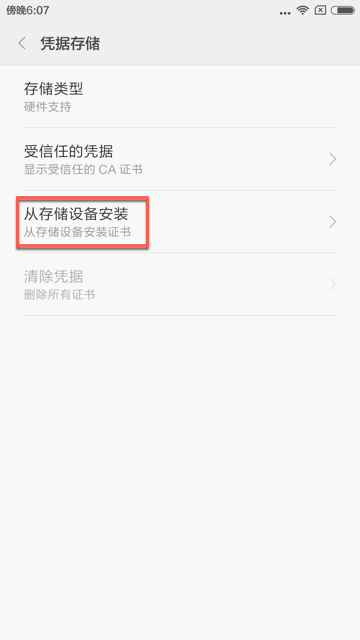

点击`从存储设备安装`后，进入文件选择界面

注意：刚进入文件选择界面时，会默认显示的`最近`里往往是空的，看不到我们要的证书文件：

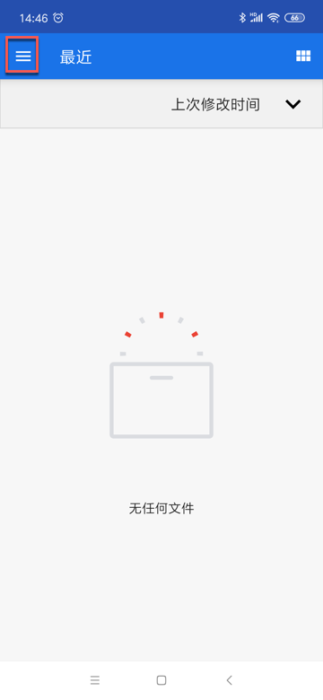

所以要去点击左上角三个横线，去切换到手机的存储设备中：

此处是`MI 9`：

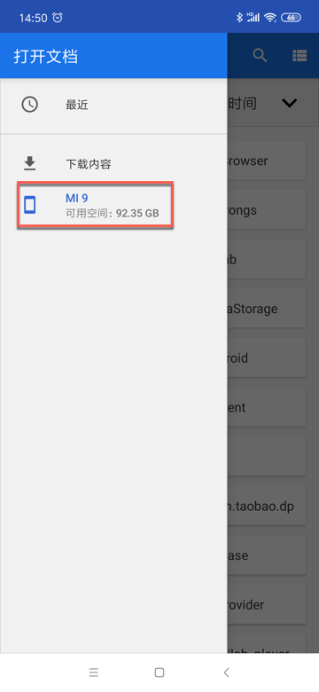

然后找到刚才下载到的证书文件：

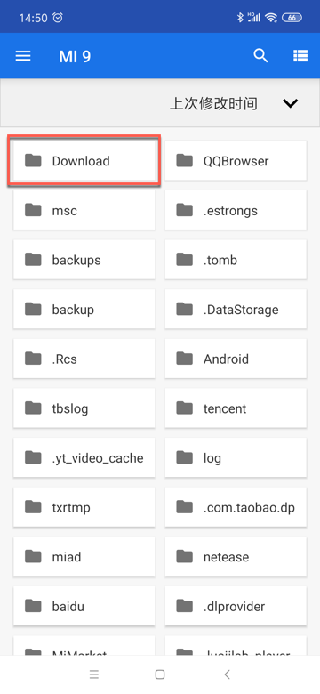

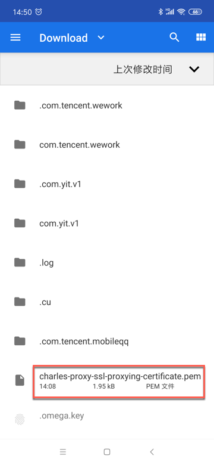

点击对应证书文件，此处的`pem`文件，即可正常继续安装。
