# iOS中安装Charles的ssl证书的典型步骤

iOS中安装Charles的ssl证书的过程，和安卓中基本上是一样的。

此处以iPhone为例去解释具体过程。

在确保iPhone中也已经设置了Wifi的代理为Charles后，用iPhone中的`Safari`去打开：

http://chls.pro/ssl

其内部也会自动跳转到：

http://charlesproxy.com/getssl

弹框提示：

```bash
此网站正尝试打开"设置"以向您显示一个配置描述文件。您要允许吗？
```

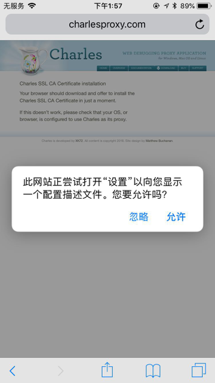

点击`允许`后，进入 安装描述文件 页：

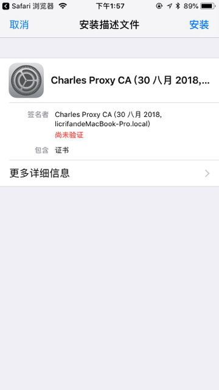

点击安装后，继续点击安装，弹出菜单后选择安装：

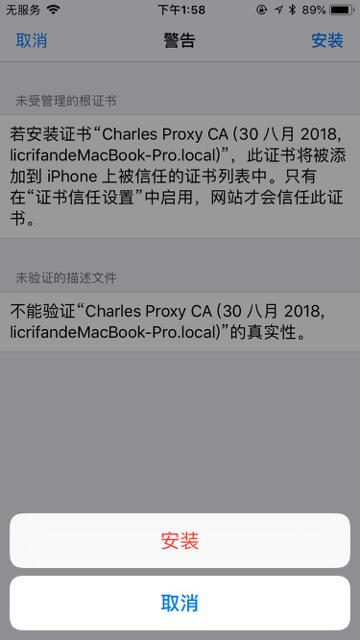

稍等片刻即可安装成功：

签名者 会显示绿色的 已验证✔️

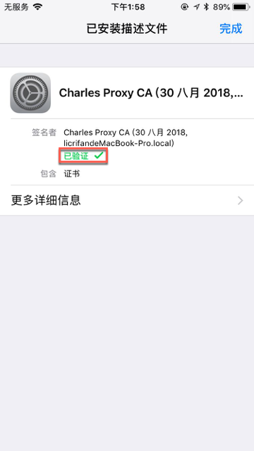

即可。

点击可进入证书详情页：

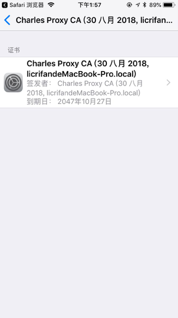

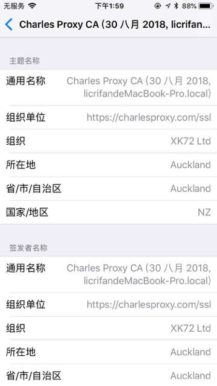

## iOS 10.3+ 还需要信任根证书

对于`iOS 10.3`之后的系统，还需要再去**信任根证书**才可以：

`设置 → 通用 → 关于本机 → 证书信任设置`

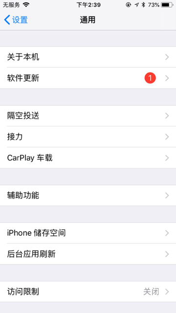

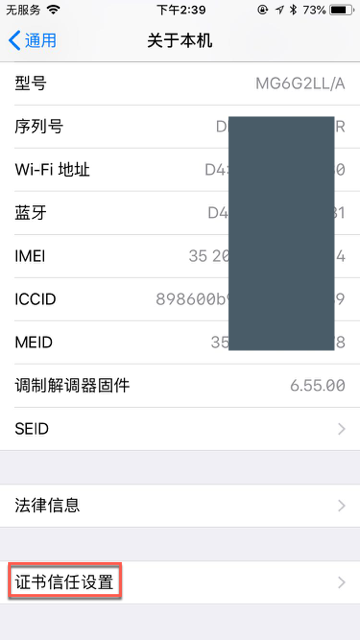

去点击勾选：`Charles Proxy CA`

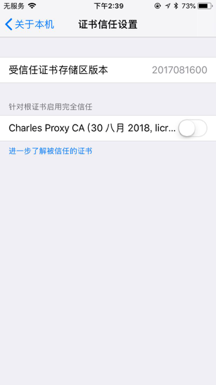

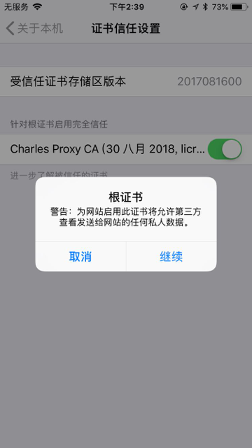

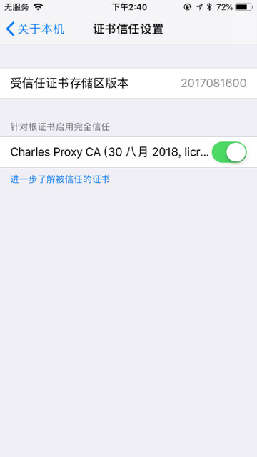
