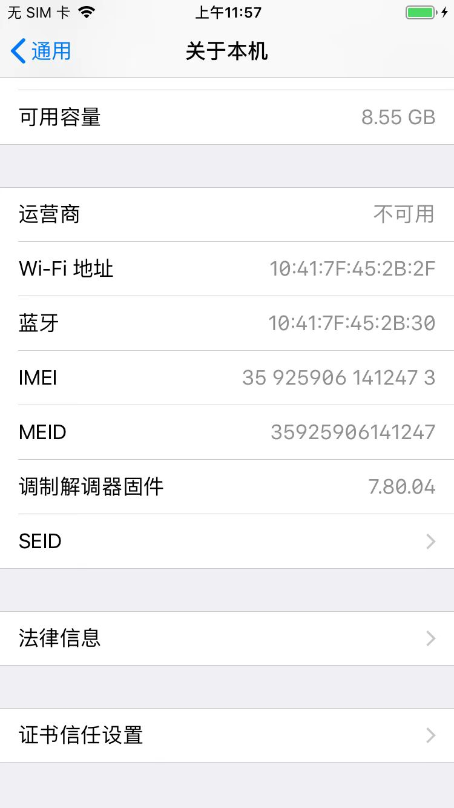
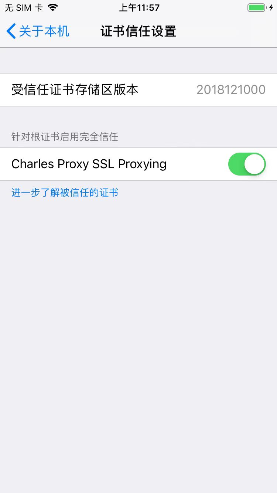

# iOS中安装Charles的ssl证书的典型步骤

iOS中安装Charles的ssl证书的过程，和安卓中基本上是一样的。

此处以iPhone为例去解释具体过程。

在确保iPhone中也已经设置了Wifi的代理为Charles后，用iPhone中的`Safari`去打开：

http://chls.pro/ssl

* 注：如果上述地址打不开，则试试
  * http://charlesproxy.com/getssl

弹框提示：

```bash
此网站正尝试打开"设置"以向您显示一个配置描述文件。您要允许吗？
```


点击`允许`后，进入 安装描述文件 页：


点击安装后，继续点击安装，弹出菜单后选择安装：


稍等片刻即可安装成功：

签名者 会显示绿色的 已验证✔️


即可。

点击可进入证书详情页：


## 去设置的本机中信任证书

`iOS 10.3+`，安装证书后，还需要信任根证书：

* `设置`->`通用`General->`关于本机`About->`证书信任设置`Certificate Trust Settings->勾选：`Charles Proxy SSL Proxying`
  * 
  * 
