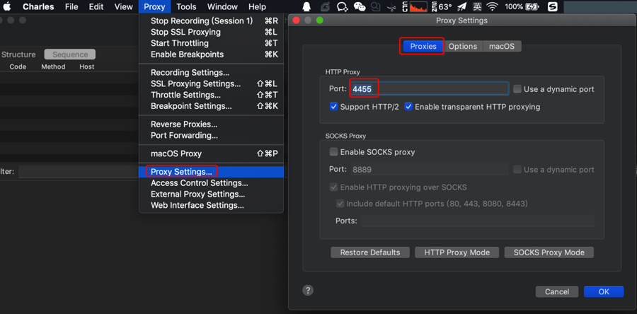
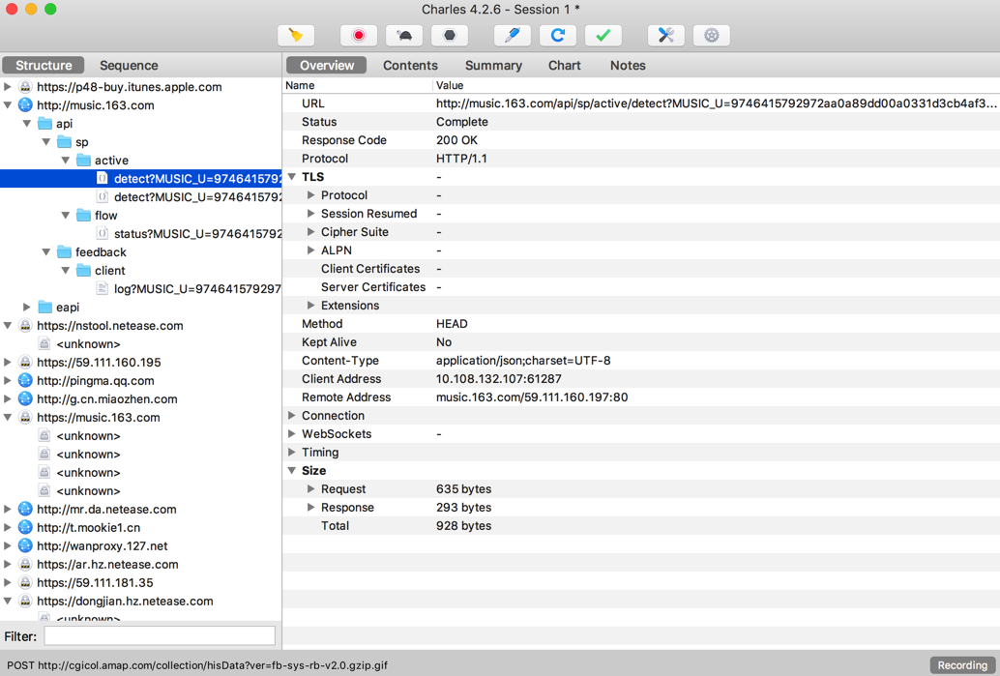

# 普通http请求

此处接着介绍，如何用Charles抓包app中普通的http的请求。

这个相对比较简单，不复杂。所以下面的相关配置也都是通用的。

核心逻辑：

* 电脑：`Mac`或`Windows`
  * `Charles`中设置HTTP代理
  * 设置代理的端口
* 手机等移动端中设置`Charles`的代理
  * WiFi中设置手动代理
    * IP地址
    * 端口

下面详细解释如何操作：

## 用Charles抓包app中普通http包的流程

### PC端设置Charles的HTTP代理

`Proxy -> Proxy Settings -> Proxies -> HTTP Proxy`

* Port：`4455`
  * 默认是`8888`
    * 可以改为自己想要的任意端口
* （默认已）勾选：
  * `Support HTTP/2`
  * `Enable transparent HTTP proxying`

### 给移动端手机中设置WiFi代理为Charles

简答：

* 确保电脑和手机是**同一个WiFi网络**
  * 注意：
    * 电脑端（最好）是有线网络
    * 手机端可以是`WiFi`无线网
* 然后设置手机端Wifi代理为Charles所在电脑的IP和Charles的HTTP代理的端口

详解：

去给手机端设置`WiFi`代理为PC端的`Charles`

基本思路：

`设置` -> `点击当前Wifi进入详情页` ->`代理`从`无`改为`手动` -> 输入`IP`和`端口`

* 代理IP：Charles所在电脑的IP
  * 此处的有线网络的IP是：`10.108.129.125`
    * 
* 代理端口：Charles中HTTP Proxy设置的端口
  * 此处：`4455`

举例：

* Android
  * 
* iOS
  * 

关于手机端设置Wifi代理的详细介绍，参见后续章节：[移动端设置Wifi代理](http://book.crifan.com/books/app_capture_package_tool_charles/website/how_capture_app/simple_http/mobile_set_wifi_proxy.html)

### Charl开启抓包

Charles中点击录制按钮：

### 手机中开始使用app

手机中打开和使用你的（要抓包的）app

比如用浏览器打开网页，打开和使用某个你要抓包的app（其内部会访问网络，调用服务器接口，获取数据等）

比如此处打开网易云音乐

### Charles可以正常抓包

接着就可以用Charles愉快的抓包和分析http的请求了：

