# Charles抓包普通http的常见问题

## 手机端已设置Charles代理但无法使用网络

手机端已经设置了Charles的代理，但是：

* 手机端还是无法上网
  * 甚至app都没有网络了
* Charles中也无法抓到包

这种情况有多种可能：

### PC端要用有线网络而不能使无线WiFi

如果各种配置都正常，但是手机端还是无法上网：

* 小米4无法访问网络
  * 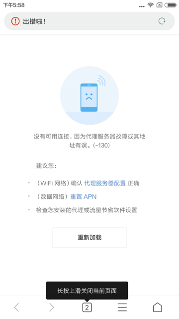
* 锤子M1L中无法使用访问
  * 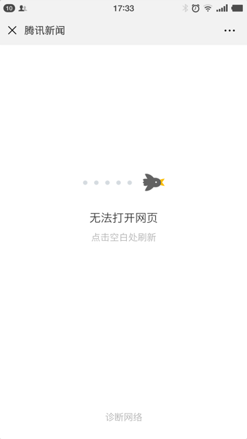

这时候可以去试试：

把PC端网络，从**无线的Wifi**换成**有线的LAN口**的网络。

#### Mac中如何使用有线网络

* 关闭无线Wifi
  * 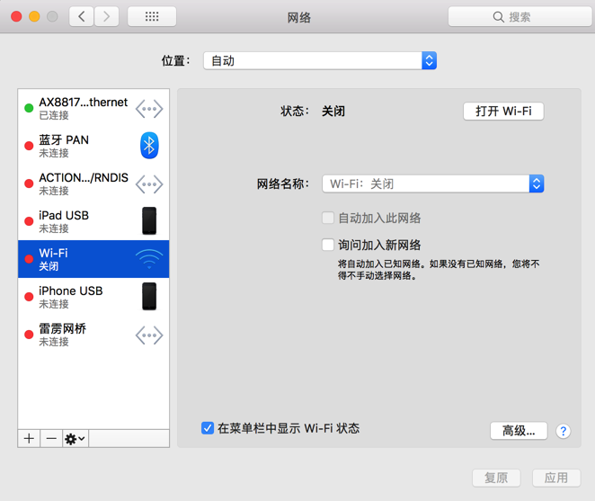
* 电脑接上有线网络
  * 此处`Mac Pro`默认没有网口，可以用**USB转网口**转换器
  * 比如
    * [绿联的20260 USB转RJ45网线接口](https://item.jd.com/983704.html)
      * 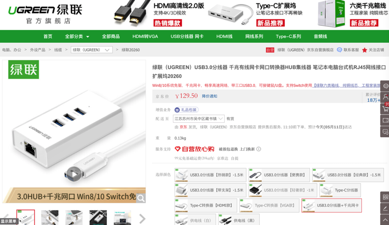
    * [绿联的20255 USB3.0千兆有线网卡转RJ45网线接口转换器](https://item.jd.com/1196493.html)
      * 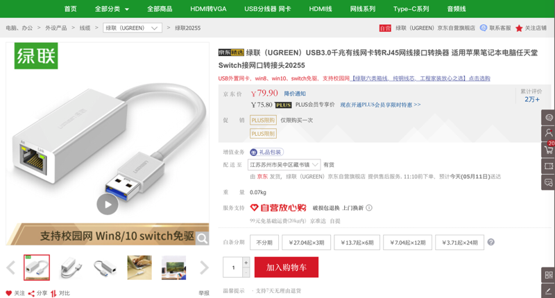
    * 绿联的USB转网口产品：绿联 CM252
      * [绿联 USB3.0分线器HUB延长线千兆有线网卡网口转换器RJ45网线接口扩展坞](https://item.jd.com/55010757635.html)
        * 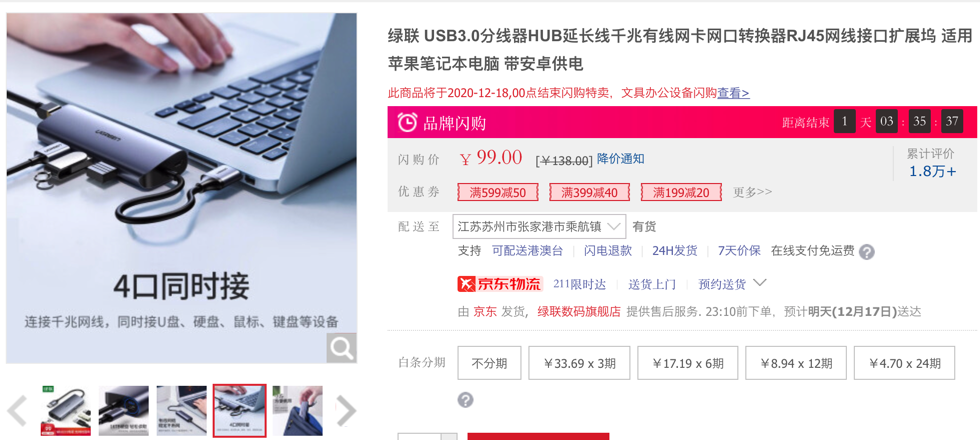
    * 我用的是另外类似的一款，带USB的USB转RJ45：
      * 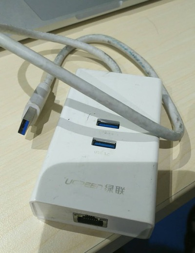
  * 然后接到Mac上：
  * 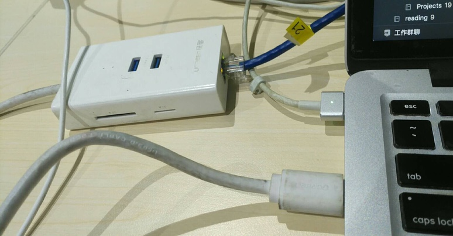
  * 电脑上即可看到：
  * 有线网卡：`AX88179 USB 3.0 to Gigabit Ethernet`
  * 和对应IP地址：`10.108.129.57`
  * 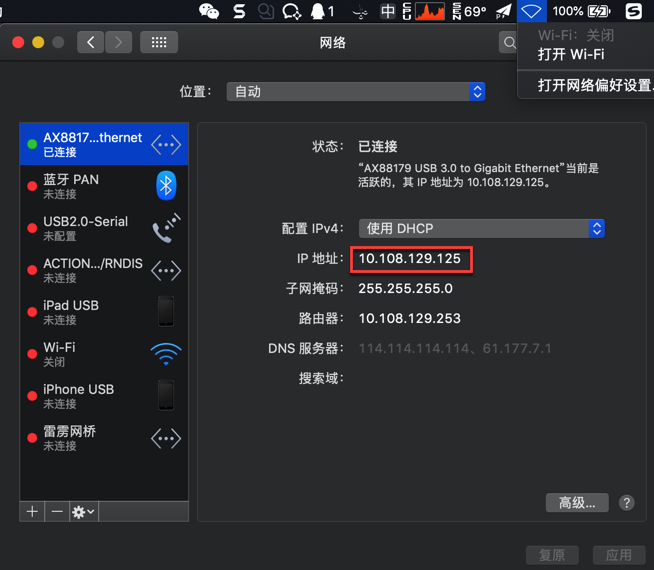

> #### info:: 有线和无线网络的IP地址范围略有不同是正常的
> 很明显，此处
> 
> * 有线网络IP是：`10.108.129.xxx`
> * 而无线网络IP是：`10.108.132.xxx`
> 
> 看起来不像同属一个网络，
> 
> 但实际上也是同属于一个局域网的
> 
> 是正常的，不需担心

### 手机端首次使用网络时，Charles要点击Allow去允许使用网络才行

注意到手机端刚刚设置Charles的Wifi代理后，手机中的Wifi会提示：`已连接，但是无法访问互联网`

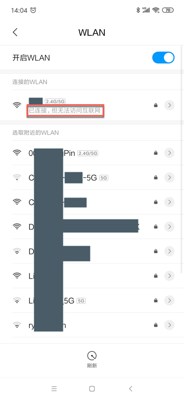

意味着：此时手机还无法正常使用网络

原因：其他设置了代理为Charles的设备，在第一次使用网络时，Charles会弹出是否允许使用网络：

```bash
A connection attempt to Charles has been made from the host x.x.x.. You should only allow
access to Charles to trusted users. If you deny this attempt you will not be asked again for this host
address until you restart Charles. Access controls are maintained in the Access Control Settings in the
Proxy menu.
```

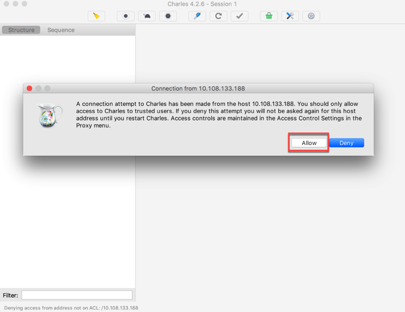

此时要点击`Allow`去允许使用网络，然后手机端才能正常使用Charles代理去访问网络。

之后你可以在：

`Proxy -> Access Control Settings`：

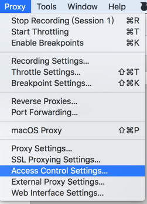

中看到你的手机的IP：


## Charles抓包看到unknown是什么意思

从上述的普通http的抓包信息中可以看到：

对于https的请求来说，Charles中抓包：

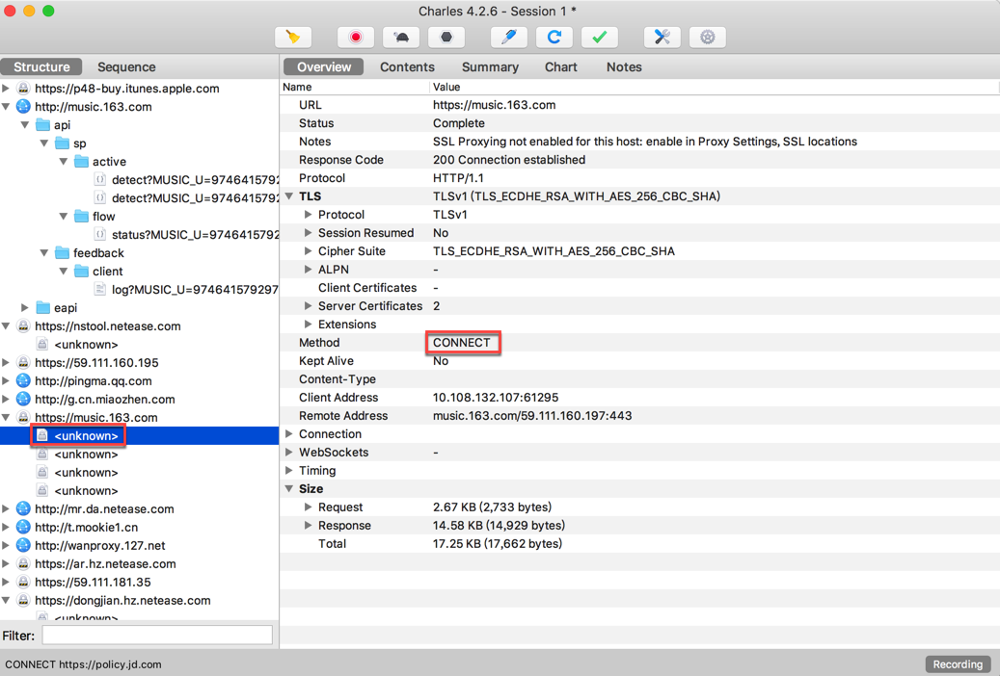

* 接口显示的是：`<unknown>`
* Method是：`CONNECT`
  * 顺带解释一下CONNECT的含义
    * 是HTTP的8中Method中的一种
    * 作用是：
      * HTTP/1.1协议中预留给能够将连接改为管道方式的代理服务器。通常用于SSL加密服务器的链接（经由非加密的HTTP代理服务器
      * 并非所有的http隧道支持connect方法
      * Http隧道分为两种
        * 不使用CONNECT的隧道
        * 使用CONNECT的隧道
      * 总之：
        * Http CONNECT相当于客户端和服务器之间建立的一个隧道
        * 而通过这个隧道的请求是加密的
          * 所以CONNECT方式的请求使用抓包是抓不到

是无法查看https的原文，明文的信息的。

想要Charles抓包https的话，相关设置要稍微复杂一点。

详见后续内容：[复杂的https请求](../../how_capture_app/complex_https/README.md)
