# 移动端设置Wifi代理

下面详细介绍移动端设置Wifi代理为Charles：

> 注：下面设置Charles的Wifi代理的IP，各自不同，请忽视，改用你自己的Charles的端口即可。

## 安卓中设置Wifi代理为Charles

### 小米4中设置的Wifi代理为Charles

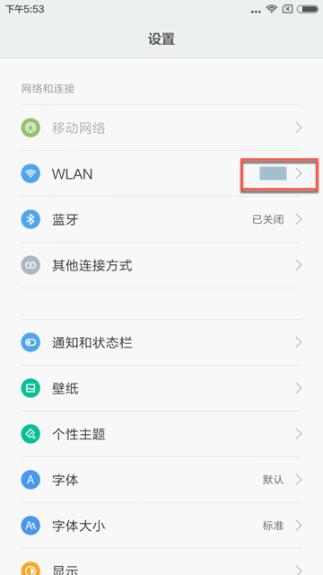

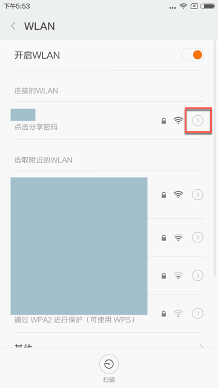

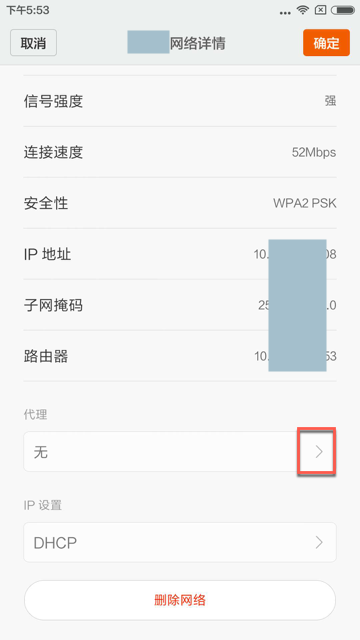

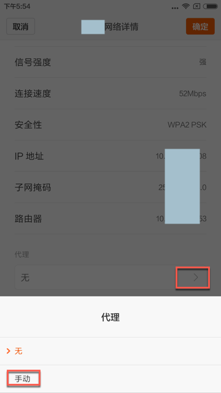

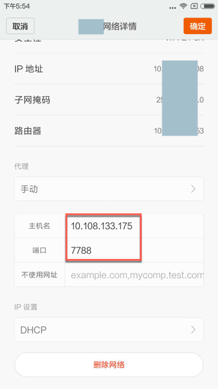

### 小米9中设置的Wifi代理为Charles

### 锤子中设置的Wifi代理为Charles

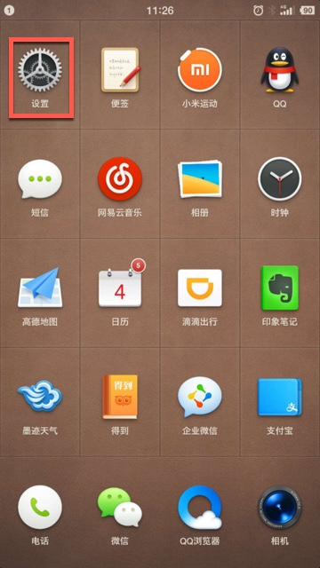

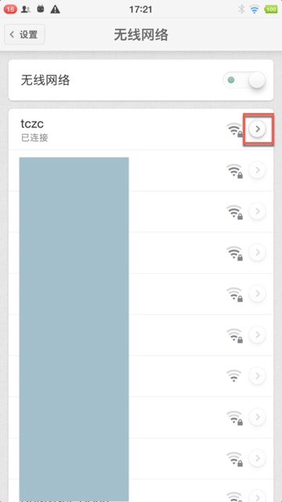

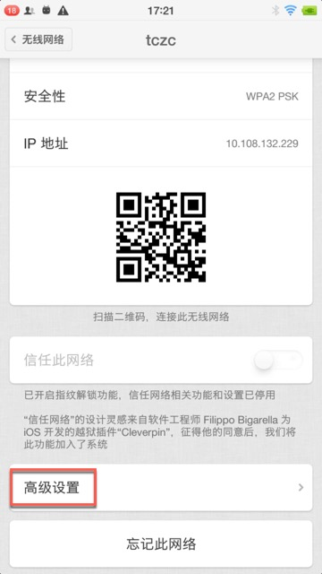

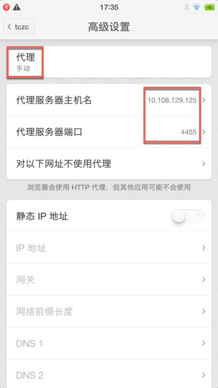

## iOS中设置Wifi代理为Charles

以`iPhone 6`为例来解释，如何给`iOS`设置Wifi代理为Charles

`设置 -> Wifi -> 点击你的Wifi -> HTTP代理 -> 配置代理`

* 手动
  * 默认是关闭，此处改为手动
* 服务器：`10.108.129.57`
* 端口：`5678`

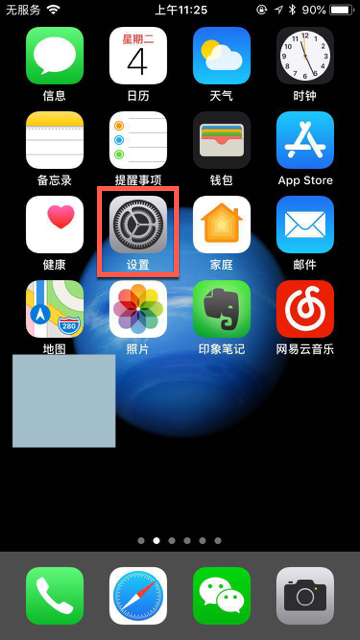

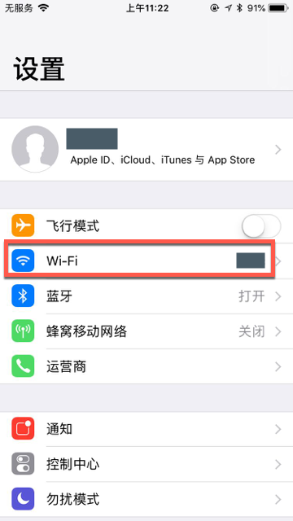

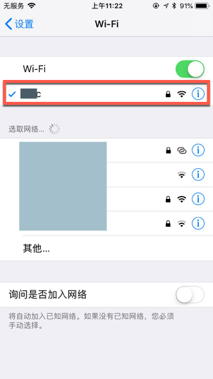

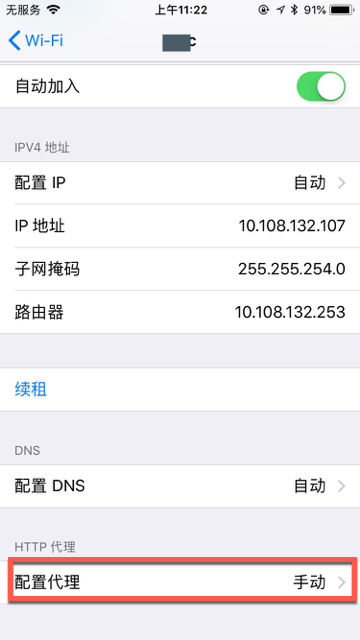

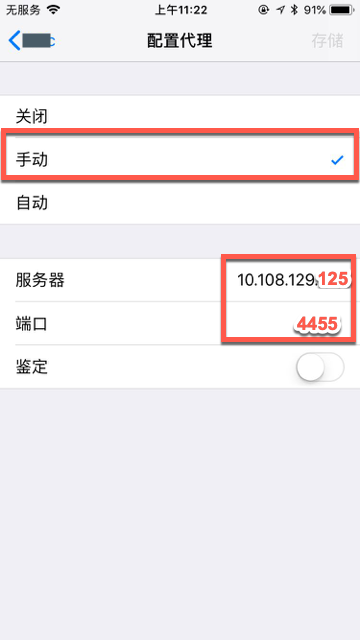