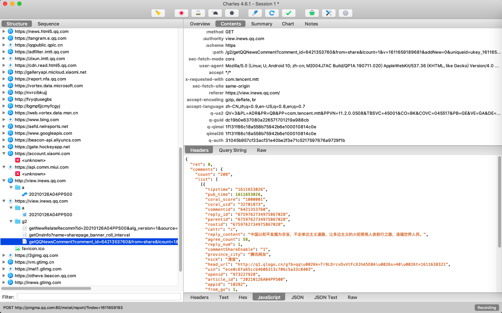
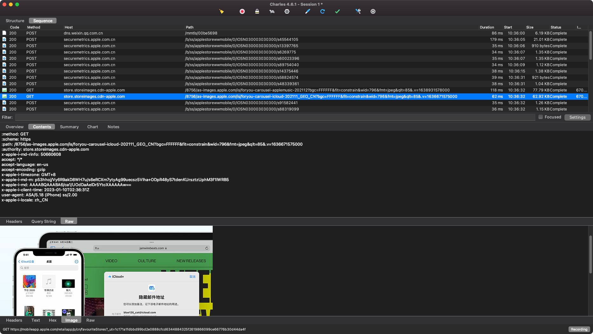

# 简介

之前有需求是，想要抓取app内的数据包，以便于分析app调用了哪些api，请求和响应分别是什么。

而app中api的请求，常见的主要是`http`和`https`的数据包。

* 注：其他也有用`websocket`的，以及有用更底层的`socket`，不在此文讨论范围

市面上也有很多用来抓包的工具：

* [Wireshark](https://www.wireshark.org)：之前`Windows`系统中用过，功能也还是很强大的
* [Fiddler](https://www.telerik.com/fiddler)：`Windows`系统中很强大的抓包工具，之前也简单用过
  * 后来也支持[Linux](http://telerik-fiddler.s3.amazonaws.com/fiddler/fiddler-linux.zip)
    * 所以`Mac`也可以用了
* [tcpdump](https://www.tcpdump.org)：一个运行在命令行下的嗅探工具
* [mitmproxy](https://mitmproxy.org)：`Man-In-The-Middle Proxy`的简称，免费和开源的交互式代理工具

关于`Mac`中的抓包工具，最后经过折腾和比较，发现的`Charles`很好用。

经过一段时间的使用，有些心得和经验，整理如下供参考。

即：

此处主要介绍，用于`Mac`中网络抓包的工具：`Charles`

* Charles
  * 支持平台：`Windows`/`Mac`
  * 典型用途
    * 去配合抓包Android手机和iPhone手机的app的网络请求，尤其是部分app的https加密数据
      * 此处用Charles配合其他工具，实现绕开https，抓包看到https的明文数据
  * Logo
    * 
  * 主页
    * https://www.charlesproxy.com/
  * 长什么样=截图
    * 显示抓包内容
      * Structure=左边数树状结构
        * 
      * Sequence=按时间先后排序列表
        * 
