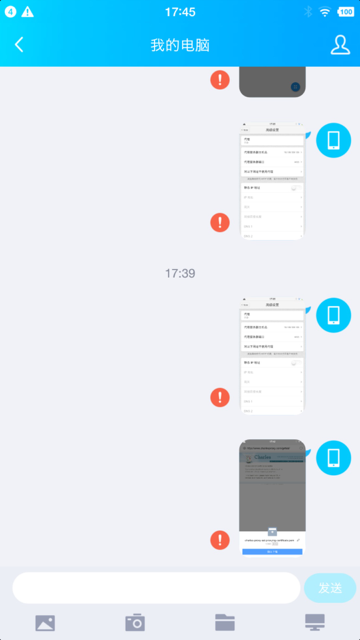
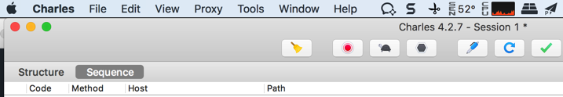

# 其他心得

此处介绍Charles相关的其他方面的心得。

## Charles代理导致部分应用无法使用网络

比如锤子M1L中，设置了Wifi代理为Charles后：

`QQ`中的，用于PC端和手机端互传文件的`文件助手`，给PC端发送非文本消息，比如图片时，就会失败：

但是奇怪的是：

* 浏览器可以正常上网
* 微信也还可以正常发送普通包括表情等文本消息的
  * 微信中的文件助手也可以正常发送图片等文件的

## Charles的CPU占用率奇高导致Mac系统卡

Mac版的`Charles v4.2.6`，在使用抓包期间，遇到过CPU占用率很高的问题，尤其是抓https的包时：

* 经常：CPU占用率奇高
  * 导致Mac系统巨卡，印象笔记中输入文字都卡
* 偶尔：CPU占用率还行，不会导致系统卡

看到提示Charles有新版：`4.2.7`

升级之前，去看了：

[Version History • Charles Web Debugging Proxy](https://www.charlesproxy.com/documentation/version-history/)

提到了Mac中

> macOS: Find dialog no longer uses 100% CPU

但是此处我Mac中Charles的查询对话框，没有导致CPU 100%，而是正常抓包导致CPU占用率接近100%

刚已去升级Charles为4.2.7，等使用一段时间后，看看CPU占用率奇高的问题，是否有改善。

此处，使用了一会，貌似CPU占用率有很大改善，暂时不会导致Mac卡死了：

此处温度也只有60度不到

-》而之前系统卡死，稳定要到70多，80多度。

又试了试，好像的确彻底解决Mac卡顿的问题了？

过了几个月，后续使用发现：Charles有时候还会CPU占用率很高，但是频率还行，不算太高，基本能接受。